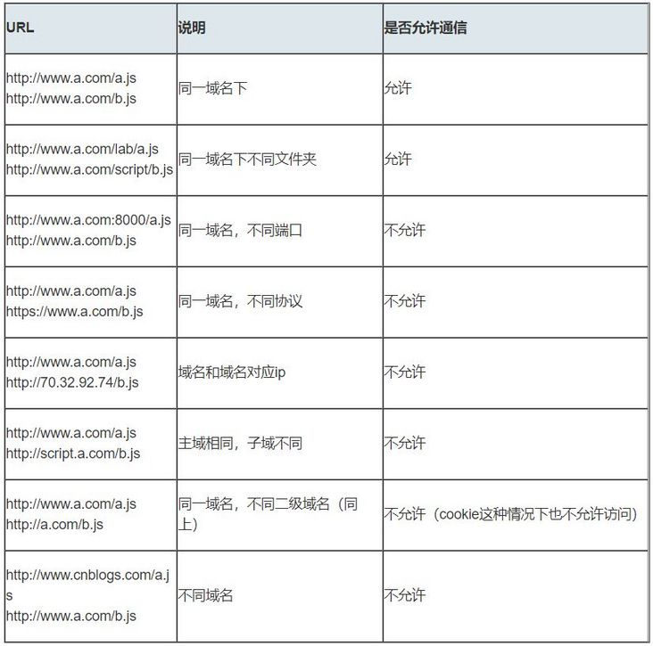
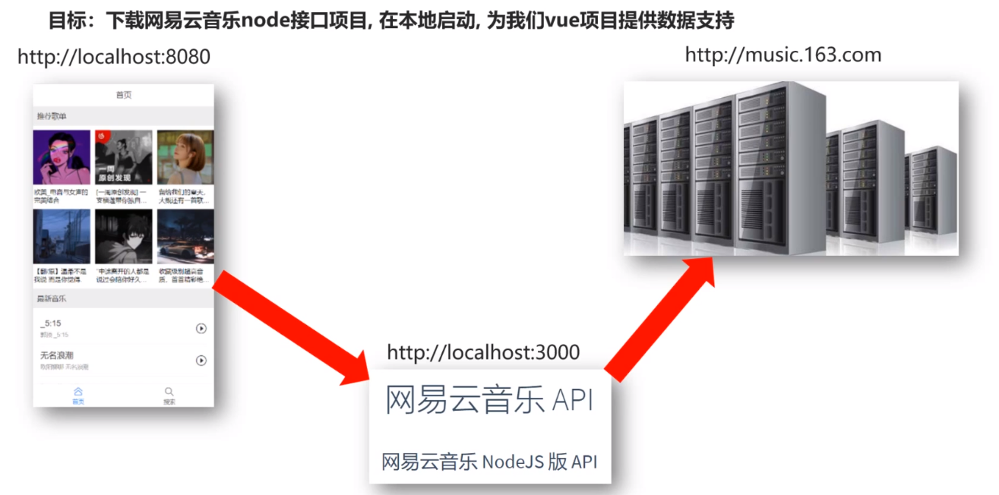
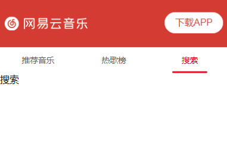
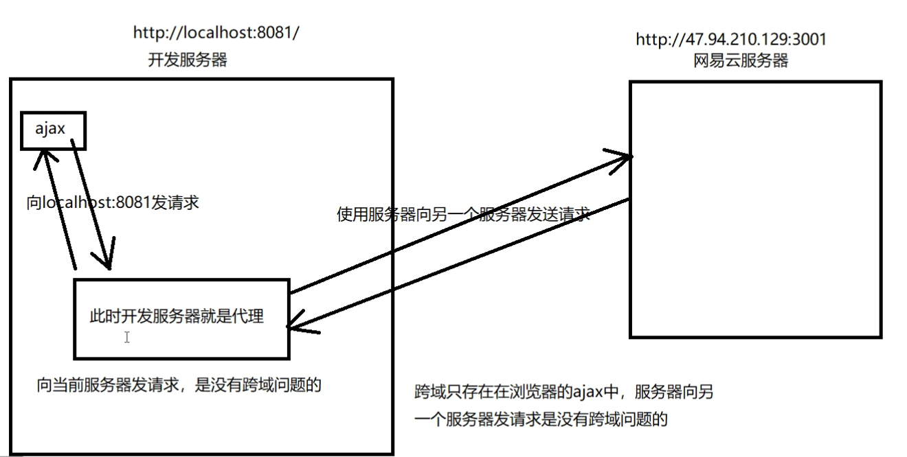

## 网易云音乐移动端

### 技术栈介绍
```js
//1. 首页
1. vant组件库
2. vue3组合式api
3. 使用axios获取，封装axios

//2. 歌单详情页
1. 路由跳转
2. 路由传参
3. 使用vuex实现底部组件的制作
4. 使用到H5的知识点以及vue的监听实现播放音乐功能

//3. 歌曲详情页
1. 使用到vant的抽屉组件
2. 使用vue3Marquee组件实现页面头部跑马灯的效果
3. 使用css3的知识点实现中间磁盘和磁针的动画效果
4. 底部的播放功能使用组件之间的通信进行传值
5. 使用动态的class以及计算属性实现对歌词样式的突出显示
7. 使用vuex以及定时器来实现进度条
8. 实现上一首和下一首的切换

//4. 搜索页面
1. 使用localStorage进行历史记录的保存，使用ES6的Set对数据进行去重
2. 在搜索出来的结果也可以进行点击播放

//5. 个人中心页面
1. 使用路由守卫，进行权限判断
2. 如果未登录，进入登录页面，实现登录功能，以及获取token，并保存下来，保持登录状态
3. 个人中心页面根据登录成功返回的个人id去获取对应的个人数据进行渲染

//6. 接口地址采用的是GitHub上大佬的接口
1. https://github.com/Binaryify/NeteaseCloudMusicApi
2. 可以下载至本地，然后通过node app.js启动后端接口
3. 或者直接用部署在我网站上的43.143.39.179:3000 进行调用接口
```

### 什么是跨域？如何解决跨域--->反向代理
```js
//1. 什么是跨域？ 只有浏览器访问服务器的时候才有跨域问题
跨域简单的理解就是JavaScript同源策略的限制。是出于安全的考虑，a.com域名下的js不能操作b.com或者c.com域名下的对象。
当协议、子域名、主域名、端口号中任意一个不相同时，都算作不同域。不同域之间相互请求资源，就算叫“跨域”。
一个正常的域名地址组成

注意：跨域不是请求发布出去，请求可以正常发出，服务器也能收到并返回结果，只是结果被浏览器所拦截了。
```


```js
//2. 如何解决？使用反向代理
我们可以在本地开一个服务器，在本地开一个代理服务器
比如使用的网易云接口地址，`http://music.163.com` 而我们使用浏览器地址是 `http://localhost:8080` 浏览器地址和ajax要请求的地址不一样，就会发生跨域，浏览器会禁止访问跨域问题，除非`http://music.163.com` 支持JSONP，或者让别人开始CORS跨域资源共享。但这种不可能

浏览器不支持直接跨域，那么我们就可以在本地自己用nodeJs写一个服务器去请求资源，前端请求本地服务器(这里`http://localhost:8080`访问`http://localhost:3000`服务器地址也是跨域，但是这个服务器是自己写的，可以开启CORS跨域资源共享，可以保证自己本地服务器没问题)，让我们写的服务器(`http://localhost:3000`)去访问`http://music.163.com`，服务器访问服务器不存在跨域，跨域是对浏览器做出的限制
```

```js
// 总结 如何做反向代理解决跨域问题？
 本地node服务器开启cors，负责请求的转发和数据接收回传
 
// Node搭建的服务，如何把数据请求回来？
收到请求后，伪造身份，请求网易云API拿到数据
```
### 1.1网易云音乐_前端项目准备
```js
初始化项目，下载必备包，引入初始文件，配置按需自动引入Vant
1. 初始化工程`(vue create qlcloudmusic-app)`
2. 下载所需第三方包 npm install `axios vant vue-router`
3. 下载Vant自动按需引入插件 `babel-plugin-import`(npm install babel-plugin-import --save-dev)
4. 在babel.config.js配置 - 看Vant文档
5. 引入提前准备好的reset.css,flexible.js 到 main.js使用
```
### 1.2 创建项目
```js
1. vue create qlcloudmusic-app
2. Manually select features
3. Babel, Router, Vuex, CSS Pre-processors
4. 3.x (因为3.x可以使用2.x的语法)
5. Yes
6. Less
7. In dedicated config files
8. N

// 第二步安装依赖
1. 进入项目目录，在搜索栏cmd，打开之后使用npm install `axios vant vue-router`
2. vant2地址 https://vant-contrib.gitee.io/vant/v2/#/zh-CN/
3. `npm install babel-plugin-import --save-dev`
4. 在babel.config.js中引入自动按需引入组件 (推荐)
快速上手-引入组件-方式一.自动按需引入，在babel.config.js中添加代码：
 "plugins": [
    ["import", {
      "libraryName": "vant",
      "libraryDirectory": "es",
      "style": true
    }]
  ]
```
*babel.config.js*
```js
module.exports = {
  presets: [
    '@vue/cli-plugin-babel/preset'
  ],
  "plugins": [
    ["import", {
      "libraryName": "vant",
      "libraryDirectory": "es",
      "style": true
    }]
  ]
}
```
*并且需要在App.vue中引入，测试样式版本的App.vue*
```js
<script>
<template>
  <div id="app">
    // 一级路由出口，如果路由里面涉及到children的话，那么还需要有二级路由出口存在，就在children那个所属的组件下面设置二级路由出口，暂时是没有
    <router-view></router-view>
	//van-button 用于测试样式，没用
    <van-button type="primary">主要按钮</van-button>
  </div>
</template>

<script>
/* 自动按需引入 */
import Vue from "vue"
import { Button } from 'vant';
Vue.use(Button)

export default {
  name: "App",
  data () {
    return {};
  },
  methods: {},
  components: {},
};
</script>

<style lang="less">
.main {
  padding-top: 45px;
  padding-bottom: 50px;
}
</style>

</script>
```
### 1.3 项目准备工作，基本骨架

*public/index.html*
```js
<!DOCTYPE html>
<html lang="">
  <head>
    <meta charset="utf-8">
    <meta http-equiv="X-UA-Compatible" content="IE=edge">
    <meta name="viewport" content="width=device-width,initial-scale=1.0">
    <link rel="icon" href="<%= BASE_URL %>favicon.ico">
    <link rel="stylesheet" href="./reset.css">
    <title><%= htmlWebpackPlugin.options.title %></title>
  </head>
  <body>
    <div id="app"></div>
  </body>
</html>
```
*public/reset.css*
```js
body,div,dl,dt,dd,ul,ol,li,h1,h2,h3,h4,h5,h6,pre,form,fieldset,input,textarea,p,blockquote,th,td {
    padding: 0;
    margin: 0;
}

table {
    border-collapse: collapse;
    border-spacing: 0;
}

fieldset,img {
    border: 0;
}

address,caption,cite,code,dfn,em,strong,
th,var {
    font-weight: normal;
    font-style: normal;
}

ol,ul {
    list-style: none;
}

caption,th {
    text-align: left;
}

h1,h2,h3,h4,h5,h6 {
    font-weight: normal;
    font-size: 100%;
}

q:before,q:after {
    content: ”;
}

abbr,acronym {
    border: 0;
}
```
*src/assets文件夹，见项目地址--后续补充*

*src/components见Home组件里面的Recommend文件夹，这次的改变时将原本的components写进了Home组件里面成为了Recommend文件夹，两种写法*

*src/router/index.js*
```js
import Vue from 'vue'
import vueRouter from 'vue-router'

Vue.use(vueRouter)

// 阻止重复点击报错
// const originalPush = vueRouter.prototype.push;
// vueRouter.prototype.push = function push(location) {
//     return originalPush.call(this, location).catch(err => err);
// }


const router = new vueRouter({
    routes: [
        {
            path: "/",
            redirect: "/home"
        },
        {
            path: '/home',
            name: 'home',
            component: () =>
                import('@/views/Home/index.vue')
        },
        // {
        //     path: '/player',
        //     name: 'player',
        //     component: () =>
        //         import ('@/views/Player')
        // },
        {
            path: '*',
            redirect: '/home'
        }
    ]
})

export default router
```
*src/store/index.js 暂时没用*
```js
import Vue from 'vue'
import Vuex from 'vuex'

Vue.use(Vuex)

export default new Vuex.Store({
  state: {
  },
  getters: {
  },
  mutations: {
  },
  actions: {
  },
  modules: {
  }
})
```
*src/App.vue*
```js
<template>
  <div id="app">
    <router-view></router-view>
  </div>
</template>

<script>
export default {
  name: "App",
  data () {
    return {};
  },
  methods: {},
  components: {},
};
</script>

<style lang="less">
.main {
  padding-top: 45px;
  padding-bottom: 50px;
}
</style>
```

*src/main.js*
```js
import Vue from 'vue'
import App from './App.vue'
import router from './router/index.js'

import axios from 'axios'
axios.defaults.baseURL = "http://47.94.210.129:3001"
Vue.prototype.$http = axios

new Vue({
  render: h => h(App),
  router
}).$mount('#app')
```
### 1.4 开始项目
**本次采用的方式与以往方式不同，本次将每一个组件都放进一个文件夹中，方便管理，适应不同人的不同写法，Home首页组件实现的是基本布局，并且本次也将components放进了Home首页组件的Recommend文件夹中，可以在文件中实现推荐音乐，热歌榜，搜索组件
#### 1.4.1 (实现头部和Tab栏切换)

##### 需求文档

```js
1. 页面头部布局部分，左侧网易云和下载APP是两个图片，这两个图片采用的是flex布局结合padding实现基本的布局，背景颜色采用的红色的background-color
2. Tab栏采用的是Vant组件库，采用的是自动按需引入，上面有详细的介绍
```
##### 代码实现
*src/views/Home/index.vue 首页布局部分*
```js
<template>
  <div>
    <div class="header">
      
      
    </div>

    // 2. 当我们需要改变切换时候的颜色，并且底部条的长度的时候，可以查看vant文档 
    // title-active-color：标题默认态颜色
    // line-width：底部条宽度，默认单位 px
    <van-tabs v-model="active"
              title-active-color="#dd001b"
              line-width="60px">
      <van-tab title="推荐音乐">
        <Recommend></Recommend>
      </van-tab>
      <van-tab title="热歌榜">热歌榜</van-tab>
      <van-tab title="搜索">搜索</van-tab>
    </van-tabs>
  </div>
</template>

<script>
//1. 已经配置好了按需引入，这里引入Tab标签页，切换页面效果
import Vue from "vue"
import { Tab, Tabs } from 'vant';

Vue.use(Tab);
Vue.use(Tabs);

//3. 引入推荐音乐组件，这里是在Home组件里面重新创建了文件夹components，叫做Recommend
import Recommend from './Recommend/index.vue'
export default {
  components: {
    Recommend
  },
  data () {
    return {
      active: 0,
    };
  },
}
</script>

<style scoped lang="less">
.header {
  padding: 20px 5px;
  display: flex;
  justify-content: space-between;
  align-items: center;
  background-color: #d43c33;
}
</style>
```
*src/views/Home/Recommend/index.vue 推荐音乐组件*
```js
<template>
  <div>推荐音乐</div>
</template>

<script>
export default {

}
</script>

<style scoped>
</style>
```
#### 1.4.2 (实现推荐音乐组件)

##### 推荐音乐组件基本局部
*src/views/Home/Recommend/index.vue*
```js
<template>
  <div>
    <div class="container">
      <h2 class="title">推荐歌单</h2>
      <div class="song-container">
        <div class="list">
          <div class="pic">
            
            <span>110</span>
          </div>
          <div class="content">音乐名字</div>
        </div>
      </div>
    </div>
  </div>
</template>

<script>
export default {

}
</script>

<style scoped lang="less">
.container {
  .title {
    padding-left: 5px;
    margin: 15px 0;
    font-size: 17px;
    border-left: 2px solid red;
  }
  .song-container {
    display: flex;
    // 可以换行 flex-wrap: wrap;
    flex-wrap: wrap;
    .list {
      margin: 2px;
      // 计算每张图片占据多少
      flex-basis: calc(33% - 4px);
      .pic {
        position: relative;
        span {
          position: absolute;
          right: 3px;
          top: 3px;
          color: #fff;
          font-size: 12px;
          background-position: center left;
          padding-left: 28px;
          // 不平铺
          background-repeat: no-repeat;
          // 背景图片变小
          background-size: 60% 60%;
        }
        img {
          width: 100%;
        }
      }
      .content {
        padding: 0px 3px;
        font-size: 13px;
      }
    }
  }
}
</style>
```
##### 推荐音乐组件请求数据与页面渲染

*src/views/Home/Recommend/index.vue*
```js
<template>
  <div>
    <div class="container">
      <h2 class="title">推荐歌单</h2>
      <div class="song-container">
        // 7.有多少条数据渲染多少个list 
        <div class="list"
             v-for="(item,index) in songList"
             :key="index">
          <div class="pic">
            // 8. 注意这里如果要自己写src这里前面必须写 :
            
            // 9.这里需要对数据进行处理 filter函数 
            <span>{{item.playCount | formatCount}} 万</span>
          </div>
          <div class="content">{{item.name}}</div>
        </div>
      </div>
    </div>
  </div>
</template>

<script>
export default {
  //2. 在created声明周期函数里面，发送ajax请求获取数据
  created () {
    this.getSongList()
  },
  name: "Recommend",
  data () {
    return {
      songList: []  //1. 推荐歌单数据
    }
  },
  //4. 实现 getSongList 方法获取数据
  methods: {
    getSongList () {
      //5. 这里是本地代理的服务器名字是 http://localhost:3000，在用接口之前需要开启本地的服务器
      // this.$http.post("http://127.0.0.1:3000/personalized?limit=6").then((res) => {
      //   this.songList = res.data.result
      // })

      //6. 前面没有写域名和端口默认是向自己8080端口发送请求，可以写在main.js里面后面请求端口就不需要再写
      // 当前服务器是：http://localhost:8080
      // 需要在main.js中为axios配置baseurl axios.defaults.baseURL = "http://127.0.0.1:3000"
      this.$http.post("/personalized?limit=6").then((res) => {
        if (res.statusText === 'OK' && res.status === 200) {
          this.songList = res.data.result
        }
      })
    }
  },
  filters: {
    formatCount (val) {
      // toFixed(1) 保留一位小数
      return (val / 10000).toFixed(1)
    }
  }
}
</script>

<style scoped lang="less">
.container {
  .title {
    padding-left: 5px;
    margin: 15px 0;
    font-size: 17px;
    border-left: 2px solid red;
  }
  .song-container {
    display: flex;
    // 可以换行 flex-wrap: wrap;
    flex-wrap: wrap;
    .list {
      margin: 2px;
      // 计算每张图片占据多少
      flex-basis: calc(33% - 4px);
      .pic {
        position: relative;
        span {
          position: absolute;
          right: 3px;
          top: 3px;
          color: #fff;
          font-size: 12px;
          background:(内容单独放下面)
          background-position: center left;
          padding-left: 28px;
          // 不平铺
          background-repeat: no-repeat;
          // 背景图片变小
          background-size: 60% 60%;
        }
        img {
          width: 100%;
        }
      }
      .content {
        padding: 0px 3px;
        font-size: 13px;
      }
    }
  }
}
</style>
```
```js
background: url(data:image/svg+xml;base64,PHN2ZyB4bWxucz0iaHR0cDovL3d3dy53My5vcmcvMjAwMC9zdmciIHZpZXdCb3g9IjAgMCAyMiAyMCI+PHBhdGggZmlsbC1ydWxlPSJldmVub2RkIiBmaWxsPSIjMDQwMDAwIiBkPSJNMjIgMTYuNzc3YzAgMS4yMzMtMS4xMjEgMi4yMzMtMi41MDYgMi4yMzMtMS4zODQgMC0yLjUwNi0xLTIuNTA2LTIuMjMzdi0yLjU1M2MwLTEuMjM0IDEuMTIyLTIuMjMzIDIuNTA2LTIuMjMzLjE3NCAwIC4zNDMuMDE3LjUwNi4wNDZ2LTEuMzdoLS4wMzNjLjAxNy0uMjIuMDMzLS40NDEuMDMzLS42NjZhOCA4IDAgMCAwLTE2IDBjMCAuMjI1LjAxNi40NDYuMDM0LjY2Nkg0djEuMzdjLjE2My0uMDI5LjMzMy0uMDQ2LjUwNS0uMDQ2IDEuMzg0IDAgMi41MDYuOTk5IDIuNTA2IDIuMjMzdjIuNTUzYzAgMS4yMzMtMS4xMjIgMi4yMzMtMi41MDYgMi4yMzNTMiAxOC4wMTEgMiAxNi43Nzd2LTIuNTUzYzAtLjI1OC4wNTktLjUwMS4xNDgtLjczQS45ODIuOTgyIDAgMCAxIDIgMTMuMDAxdi0yLjY2N2MwLS4wMjMuMDEyLS4wNDMuMDEzLS4wNjctLjAwNC0uMDg4LS4wMTMtLjE3Ni0uMDEzLS4yNjYgMC01LjUyMyA0LjQ3Ny0xMCAxMC0xMHMxMCA0LjQ3NyAxMCAxMGMwIC4wOS0uMDA5LjE3OC0uMDE0LjI2Ni4wMDIuMDI0LjAxNC4wNDQuMDE0LjA2N3YyYS45ODguOTg4IDAgMCAxLS4zNi43NTNjLjIyNC4zMzQuMzYuNzIuMzYgMS4xMzh2Mi41NTIiIG9wYWNpdHk9Ii4xNSIvPjxwYXRoIGZpbGwtcnVsZT0iZXZlbm9kZCIgZmlsbD0iI2ZmZiIgZD0iTTIwIDE2Ljc3N2MwIDEuMjMzLTEuMTIxIDIuMjMzLTIuNTA2IDIuMjMzLTEuMzg0IDAtMi41MDYtMS0yLjUwNi0yLjIzM3YtMi41NTNjMC0xLjIzNCAxLjEyMi0yLjIzMyAyLjUwNi0yLjIzMy4xNzQgMCAuMzQzLjAxNy41MDYuMDQ2di0xLjM3aC0uMDMzYy4wMTctLjIyLjAzMy0uNDQxLjAzMy0uNjY2YTggOCAwIDAgMC0xNiAwYzAgLjIyNS4wMTYuNDQ2LjAzNC42NjZIMnYxLjM3Yy4xNjMtLjAyOS4zMzMtLjA0Ni41MDUtLjA0NiAxLjM4NCAwIDIuNTA2Ljk5OSAyLjUwNiAyLjIzM3YyLjU1M2MwIDEuMjMzLTEuMTIyIDIuMjMzLTIuNTA2IDIuMjMzUzAgMTguMDExIDAgMTYuNzc3di0yLjU1M2MwLS4yNTguMDU5LS41MDEuMTQ4LS43M0EuOTgyLjk4MiAwIDAgMSAwIDEzLjAwMXYtMi42NjdjMC0uMDIzLjAxMi0uMDQzLjAxMy0uMDY3LS4wMDQtLjA4OC0uMDEzLS4xNzYtLjAxMy0uMjY2IDAtNS41MjMgNC40NzctMTAgMTAtMTBzMTAgNC40NzcgMTAgMTBjMCAuMDktLjAwOS4xNzgtLjAxNC4yNjYuMDAyLjAyNC4wMTQuMDQ0LjAxNC4wNjd2MmEuOTg4Ljk4OCAwIDAgMS0uMzYuNzUzYy4yMjQuMzM0LjM2LjcyLjM2IDEuMTM4djIuNTUyIi8+PC9zdmc+);
```
##### 推荐音乐组件最新音乐部分布局

*src/views/Home/Recommend/index.vue 序号10*
```js
<template>
  <div>
    <div class="container">
      /* 推荐歌单部分 star */
      <h2 class="title">推荐歌单</h2>
      <div class="song-container">
       /* 7.有多少条数据渲染多少个list star */
        <div class="list"
             v-for="(item,index) in songList"
             :key="index">
          <div class="pic">
          /* 8.注意这里如果要自己写src这里前面必须写 : */
            
           /* 9.这里需要对数据进行处理 filter函数 */
            <span>{{item.playCount | formatCount}} 万</span>
          </div>
          <div class="content">{{item.name}}</div>
        </div>
      </div>
      /* 推荐歌单部分 end */

      /* 10.实现最新音乐部分布局 star */
      <h2 class="title">最新音乐</h2>
      <ul class="top-list">
        <li>
          <p class="name">音乐名字</p>
          /* sq小图标 */
          <div class="info">
            <i class="sq"></i>
            /* 音乐专辑 */
            <span class="zj">音乐专辑</span>
          </div>
          /* 播放按钮 */
          <div class="play"></div>
        </li>
      </ul>
      /* 最新音乐部分 end */
    </div>
  </div>
</template>

<script>
export default {
  //2. 在created声明周期函数里面，发送ajax请求获取数据
  created () {
    this.getSongList()
  },
  name: "Recommend",
  data () {
    return {
      songList: []  //1. 推荐歌单数据
    }
  },
  //4. 实现 getSongList 方法获取数据
  methods: {
    getSongList () {
      //5. 这里是本地代理的服务器名字是 http://localhost:3000，在用接口之前需要开启本地的服务器
      // this.$http.post("http://127.0.0.1:3000/personalized?limit=6").then((res) => {
      //   this.songList = res.data.result
      // })

      //6. 前面没有写域名和端口默认是向自己8080端口发送请求，可以写在main.js里面后面请求端口就不需要再写
      // 当前服务器是：http://localhost:8080
      // 需要在main.js中为axios配置baseurl axios.defaults.baseURL = "http://127.0.0.1:3000"
      this.$http.post("/personalized?limit=6").then((res) => {
        if (res.statusText === 'OK' && res.status === 200) {
          this.songList = res.data.result
        }
      })
    }
  },
  filters: {
    formatCount (val) {
      // toFixed(1) 保留一位小数
      return (val / 10000).toFixed(1)
    }
  }
}
</script>

<style lang="less" scoped>
.container {
  .title {
    padding-left: 5px;
    margin: 15px 0;
    font-size: 17px;
    border-left: 2px solid red;
  }
  height: 1200px;

  .song-container {
    display: flex;
    // 歌单推荐部分布局可以换行 flex-wrap: wrap;
    flex-wrap: wrap;
    .list {
      margin: 2px;
      // 计算每张图片占据多少
      flex-basis: calc(33% - 4px);
      .pic {
        position: relative;
        span {
          position: absolute;
          right: 3px;
          top: 3px;
          color: #fff;
          font-size: 12px;
          background: (这部分内容同上)
          background-position: center left;
          padding-left: 28px;
          background-repeat: no-repeat;
          // 背景图片变小，耳机小图标
          background-size: 60% 60%;
        }
        img {
          width: 100%;
        }
      }
      .content {
        padding: 0px 3px;
        font-size: 13px;
      }
    }
  }
}
//11. 最新音乐部分样式 
.top-list {
  padding-left: 10px;
  li {
    padding: 5px 0;
    border-bottom: 0.5px solid rgba(0, 0, 0, 0.1);
    padding-right: 32px;
    position: relative;
    .play {
      position: absolute;
      right: 10px;
      top: 50%;
      transform: translateY(-50%);
      width: 22px;
      height: 22px;
      background: url('../../../assets/img/index_icon.jpg');
      background-repeat: no-repeat;
      background-position: -24px 0;
      background-size: 166px 97px;
    }
    .name {
      font-size: 17px;
    }
    .info {
      .zj {
        font-size: 12px;
        color: #888;
      }
      .sq {
        display: inline-block;
        width: 12px;
        height: 8px;
        margin-right: 4px;
        background: url('../../../assets/img/index_icon.jpg');
        background-size: 166px 97px;
      }
    }
  }
}
.footer {
  background: url('../../../assets/img/recommand_bg_2x.png') no-repeat;
  background-size: 100% 100%;
  position: relative;
  padding: 30px 0;
  .openapp {
    line-height: 38px;
    border: 1px solid #d33a31;
    border-radius: 38px;
    font-size: 16px;
    color: #d33a31;
    margin: 15px 37px 5px;
    text-align: center;
  }
}
</style>
```
##### 推荐音乐组件最新音乐部分获取数据与页面渲染(12~15)，和页面底部的实现(16~17)，以及自定义指令实现高度的计算(18~21)---><font color="red">推荐音乐组件完结</font>
*src/views/Home/Recommend/index.vue*
```js
<template>
  <div>
    // 18.v-height 直接写v-height代表的是整个文档的高度，写126就是文档高度减去126
    <div class="container"
         v-height="126">
      // 推荐歌单部分 star 
      <h2 class="title">推荐歌单</h2>
      <div class="song-container">
        // 7.有多少条数据渲染多少个list
        <div class="list"
             v-for="(item,index) in songList"
             :key="index">
          <div class="pic">
            //  8. 注意这里如果要自己写src这里前面必须写 :
            
            // 9.这里需要对数据进行处理 filter函数 
            <span>{{item.playCount | formatCount}} 万</span>
          </div>
          <div class="content">{{item.name}}</div>
        </div>
      </div>
      // 推荐歌单部分 end 
      // 10.实现最新音乐部分布局 star
      <h2 class="title">最新音乐</h2>
      <ul class="top-list">
        // 15.有多少条数据就渲染多少个li
        <li v-for="(item,index) in topList"
            :key="index">
          <p class="name">{{item.name}}</p>
          // sq小图标 接口返回数据中如果item.song.sqMusic有值就显示，没有值就不显示
          <div class="info">
            <i class="sq"
               v-if="item.song.sqMusic != null"></i>
            // 音乐专辑
         <span class="zj">{{item.song.artists[0].name}} - {{item.song.album.name}}</span>
          </div>
          //  播放按钮部分 star 
          <div class="play"></div>
          //  播放按钮部分 end
        </li>
      </ul>
      // 最新音乐部分 end 
      // 16. 底部部分的实现 star
      <div class="footer">
        <div class="openapp"
             @click="openUrl">
          打开APP，发现更好音乐
        </div>
      </div>
      // 底部部分的实现 end
    </div>
  </div>
</template>

<script>
export default {
  //2. 在created声明周期函数里面，发送ajax请求获取数据
  created () {
    this.getSongList()
    //13. getTopList()
    this.getTopList()
  },
  name: "Recommend",
  data () {
    return {
      songList: [],  //1. 推荐歌单数据
      topList: [],    //12. 最新音乐数据
    }
  },
  //4. 实现 getSongList 方法获取数据
  methods: {
    getSongList () {
      //5. 这里是本地代理的服务器名字是 http://localhost:3000，在用接口之前需要开启本地的服务器
      // this.$http.post("http://127.0.0.1:3000/personalized?limit=6").then((res) => {
      //   this.songList = res.data.result
      // })

      //6. 前面没有写域名和端口默认是向自己8080端口发送请求，可以写在main.js里面后面请求端口就不需要再写
      // 当前服务器是：http://localhost:8080
      // 需要在main.js中为axios配置baseurl axios.defaults.baseURL = "http://127.0.0.1:3000"
      this.$http.post("/personalized?limit=6").then((res) => {
        if (res.statusText === 'OK' && res.status === 200) {
          this.songList = res.data.result
        }
      })
    },
    //14. 发送ajax请求，获取最新音乐数据
    getTopList () {
      this.$http.post("/personalized/newsong").then((res) => {
        if (res.statusText === 'OK' && res.status === 200) {
          this.topList = res.data.result
        }
      })
    },
    //17. openUrl方法的实现，打开一个url
    openUrl () {
      window.location = "https://m.music.163.com/m/applink/?scheme=orpheus%3A%2F%2Fopenurl";
    }
  },
  filters: {
    formatCount (val) {
      // toFixed(1) 保留一位小数
      return (val / 10000).toFixed(1)
    }
  }
}
</script>

<style lang="less" scoped>
.container {
  .title {
    padding-left: 5px;
    margin: 15px 0;
    font-size: 17px;
    border-left: 2px solid red;
  }
  height: 1200px;

  .song-container {
    display: flex;
    // 歌单推荐部分布局可以换行 flex-wrap: wrap;
    flex-wrap: wrap;
    .list {
      margin: 2px;
      // 计算每张图片占据多少
      flex-basis: calc(33% - 4px);
      .pic {
        position: relative;
        span {
          position: absolute;
          right: 3px;
          top: 3px;
          color: #fff;
          font-size: 12px;
          background: (代码同上);
          background-position: center left;
          padding-left: 28px;
          background-repeat: no-repeat;
          // 背景图片变小，耳机小图标
          background-size: 60% 60%;
        }
        img {
          width: 100%;
        }
      }
      .content {
        padding: 0px 3px;
        font-size: 13px;
      }
    }
  }
}

//11. 最新音乐部分样式
.top-list {
  padding-left: 10px;
  li {
    padding: 5px 0;
    border-bottom: 0.5px solid rgba(0, 0, 0, 0.1);
    padding-right: 32px;
    position: relative;
    .play {
      position: absolute;
      right: 10px;
      top: 50%;
      transform: translateY(-50%);
      width: 22px;
      height: 22px;
      background: url('../../../assets/img/index_icon.jpg');
      background-repeat: no-repeat;
      background-position: -24px 0;
      background-size: 166px 97px;
    }
    .name {
      font-size: 17px;
    }
    .info {
      .zj {
        font-size: 12px;
        color: #888;
      }
      .sq {
        display: inline-block;
        width: 12px;
        height: 8px;
        margin-right: 4px;
        background: url('../../../assets/img/index_icon.jpg');
        background-size: 166px 97px;
      }
    }
  }
}
.footer {
  background: url('../../../assets/img/recommand_bg_2x.png') no-repeat;
  background-size: 100% 100%;
  position: relative;
  padding: 30px 0;
  .openapp {
    line-height: 38px;
    border: 1px solid #d33a31;
    border-radius: 38px;
    font-size: 16px;
    color: #d33a31;
    margin: 15px 37px 5px;
    text-align: center;
  }
}
</style>
```
*src/main.js*
```js
import Vue from 'vue'
import App from './App.vue'
import router from './router/index.js'


import axios from 'axios'
axios.defaults.baseURL = "http://127.0.0.1:3000"
Vue.prototype.$http = axios

//18. 自定义指令实现高度的计算，写完之后就可以在推荐歌单组件里面使用v-height="126"
// 期望的是，上面的header占据文档的126高度，下面部分占文档剩下的部分 window.innerHeight - 126
Vue.directive("height", {
  /*inserted函数表示当绑定了该指令的元素被插入到dom时候会自动触发
  el表示当顶了该指令的dom对象*/
  inserted (el, options) {
    //19. 通过options.value就可以拿到高度126
    // console.log(options.value)
    if (typeof options.value == "number") {
      //20. 将整个文档的高度变成126
      return el.style.height = (window.innerHeight - options.value) + "px"
    } else {
      //21. 直接写 v-height 说明没有传值就是整个文档的高度，就不需要减去126
      return el.style.height = (window.innerHeight) + "px"
    }
  }
})

new Vue({
  render: h => h(App),
  router
}).$mount('#app')
```

#### 1.4.3 (实现热歌榜组件)

##### 使用动态组件(3~11)
*src/views/Home/index.vue*
```js
<template>
  <div>
    <div class="header">
      
      
    </div>
    // 2. 当我们需要改变切换时候的颜色，并且底部条的长度的时候，可以查看vant文档 
    // title-active-color：标题默认态颜色
    // line-width：底部条宽度，默认单位 px
    //9. 当点击切换的时候就会调用change事件 
    <van-tabs v-model="active"
              title-active-color="#dd001b"
              line-width="60px"
              @change="changeTab">
      <van-tab title="推荐音乐">
        //6.注释掉，用动态组件 <Recommend></Recommend>
      </van-tab>
      <van-tab title="热歌榜">
      // 5. 但是这样写会有一个问题就是切换组件的时候调用钩子函数created(){}，除了第一次会
      // 创建之外，剩下的再次进行切换就会被缓存起来，并不会重新调用created(){}钩子函数，那么如果
      // 接口里面的数据发生改变的话，也不会重新刷新数据 
        // 6.注释掉，用动态组件 <Hot></Hot> 
      </van-tab>
      <van-tab title="搜索">搜索</van-tab>
    </van-tabs>
    // 7. 使用动态组件，那么当我们进行切换页面的时候就不会被缓存起来，每一次切换页面都会调用
    // created(){}钩子函数和ajax请求 
    <div>
      <component :is="componentType"></component>
    </div>
  </div>
</template>

<script>
//1. 已经配置好了按需引入，这里引入Tab标签页，切换页面效果
import Vue from "vue"
import { Tab, Tabs } from 'vant';

Vue.use(Tab);
Vue.use(Tabs);

//3. 引入推荐音乐组件，这里是在Home组件里面重新创建了文件夹components，叫做Recommend
import Recommend from './Recommend/index.vue'

//4. 引入热歌榜组件
import Hot from './Hot/index.vue'
export default {
  components: {
    Recommend,
    Hot
  },
  data () {
    return {
      active: 0,
      //8. 动态组件部分默认是 Recommend 推荐音乐组件
      componentType: "Recommend"
    };
  },
  //11. 实现changeTab方法，里面有个参数是id，id代表了Tab栏的序号
  methods: {
    changeTab (val) {
      if (val === 0) {
        this.componentType = "Recommend"
      } else if (val === 1) {
        this.componentType = "Hot"
      } else {
        this.componentType = "Hot"
      }
    }
  }
}
</script>

<style scoped lang="less">
.header {
  padding: 20px 5px;
  display: flex;
  justify-content: space-between;
  align-items: center;
  background-color: #d43c33;
}
</style>
```
##### 实现热歌榜页面布局和数据渲染
*src/views/Home/Hot/index.vue*
```js
<template>
  <div class="container"
       v-height="126">
    <div class="pic">
      <div class="hot"></div>
      <span>更新时间：</span>
    </div>

    <ul class="top-list">
      <li v-for="(item, index) in hotList"
          :key="index">
        <p class="name">{{ item.name }}</p>
        <div class="info">
          <i class="sq"></i>
          <span class="zj"> {{ item.ar[0].name }} </span>
        </div>
        <i class="play"></i>
      </li>
    </ul>
  </div>
</template>

<script>
import moment from "moment";

import Vue from "vue";
import { Toast } from "vant";
Vue.use(Toast);

export default {
  name: "Hot",
  props: [],
  data () {
    return {
      hotList: [],
    };
  },
  created () {
    this.getHotList();
  },
  components: {
  },
  methods: {
    getHotList () {
      this.$http.post("/playlist/detail?id=3778678").then((res) => {
        if (res.statusText === "OK" && res.status === 200) {
          this.hotList = res.data.playlist.tracks;
        }
      })
    },
  },
};
</script>

<style lang="less" scoped>
.container {
  height: 500px;
  overflow: auto;
}

.pic {
  position: relative;
  height: 146px;
  padding-left: 20px;
  padding-top: 20px;
  overflow: hidden;
  background: url('../../../assets/img/hot_music_bg.jpg') no-repeat;
  background-size: contain;

  .hot {
    width: 142px;
    height: 67px;
    background: url('../../../assets/img/index_icon.jpg') no-repeat;
    background-size: 166px 97px;
    background-position: -24px -30px;
  }

  span {
    display: inline-block;
    margin-top: 15px;
    font-size: 12px;
    color: #fff;
    line-height: 24px;
  }
}

.top-list {
  padding-left: 10px;

  li {
    padding: 5px 0;
    border-bottom: 0.5px solid rgba(0, 0, 0, 0.1);
    padding-right: 32px;
    position: relative;

    .play {
      position: absolute;
      right: 10px;
      top: 50%;
      transform: translateY(-50%);
      width: 22px;
      height: 22px;
      background: url('../../../assets/img/index_icon.jpg');
      background-repeat: no-repeat;
      background-position: -24px 0;
      background-size: 166px 97px;
    }

    .name {
      font-size: 17px;
    }

    .info {
      .zj {
        font-size: 12px;
        color: #888;
      }

      .sq {
        display: inline-block;
        width: 12px;
        height: 8px;
        margin-right: 4px;
        background: url('../../../assets/img/index_icon.jpg');
        background-size: 166px 97px;
      }
    }
  }
}
</style>
```

##### 代理解决跨域问题

```js
const { defineConfig } = require('@vue/cli-service')
const path = require("path")

function resolve (dir) {
  return path.join(__dirname, dir)
}

module.exports = defineConfig({
  transpileDependencies: true,
  //1. 只有浏览器的ajax请求才有跨域问题
  //2. script 标签中的src img标签中的src ... 是没有跨域问题的 JSONP的原理就是利用script标签
  //3. 解决：1> 通过浏览器插件解决(有时候不靠谱) 2. 通过代理解决  3. 后端解决
  //4. 百度 vue.config.js配置代理解决跨域
  // devServer 就是自己的服务器(开发服务器8080)
  devServer: {
    //5. 配置代理解决跨域，比如我们这里设置以api开头的就会被拦截下来，在main.js里面的baseUrl是"/api"
    //6. 是以api开头的话，就会被代理拦截下来
    proxy: {
      "/api": {
        //7. 拦截下来之后，需要告诉代理，请求的服务器是谁
        target: "http://127.0.0.1:3000",
        changeOrigin: true,
        //8. 如果动了vue.config.js需要重启服务器，就是项目重新启动
        //9. 但是需要注意的是，当我们使用了代理服务器那么请求的地址就自己变了，变成了
        //10. http://127.0.0.1:3000/api/personalized?limit=6  这个地址我们是不能得到数据的，会报错404
        //11. 多了一个api，接口是错的，所以数据还是回不来，这时候我们需要去除前面的 /api
        pathRewrite: {
          "^/api": ""
        }
      }
    }
  },
  //12. 所有的项目，基本都会使用代理来解决跨域问题
  chainWebpack: (config) => {
    // 第一参数@$代表别名，第二个参数代表替代的开始路径
    config.resolve.alias.set("@$", resolve('src'))
  }
})
```
##### 添加Loading效果
```js
需要重新定义一个公共组件，在components中注册Loading组件，用于实现加载页面的效果，所涉及到的区域均采用了大写 一二三四来实现，依然采用一个组件一个文件夹的设计模式
```
*src/components/Loading/index.vue*
```js
<template>
  <div class="mask">
    <van-loading type="spinner"
                 size="34px" />
  </div>
</template>

<script>
//1. Loading 加载效果
import Vue from 'vue';
import { Loading } from 'vant';

Vue.use(Loading);
export default {

}
//2. 在推荐歌单和热歌中使用Loading需要去对应的组件中使用Loading效果
</script>

// 3.Loading 样式实现 
// 4. 在推荐歌单和热歌榜组件中实现一个中间值去控制Loading的显示与否

<style scoped lang="less">
.mask {
  position: absolute;
  top: 0;
  left: 0;
  width: 100%;
  z-index: 999;
  height: 100%;
  display: flex;
  justify-content: center;
  align-items: center;
  background: rgba(0, 0, 0, 0.5);
}
</style>
```
##### 在推荐音乐中添加Loading效果(大写一二三次为涉及到的区域)
*src/views/Home/Recommend/index.vue*
```js
<template>
  <div>
    // 三、使用v-if来控制，Loading的显示与否
    <Loading v-if="isShowLoading"></Loading>
    // 18.v-height 直接写v-height代表的是整个文档的高度，写126就是文档高度减去126
    <div class="container"
         v-height="126">
      // 推荐歌单部分 star 
      <h2 class="title">推荐歌单</h2>
      <div class="song-container">
        // 7.有多少条数据渲染多少个list 
        <div class="list"
             v-for="(item,index) in songList"
             :key="index">
          <div class="pic">
            // 8. 注意这里如果要自己写src这里前面必须写 :
            
            // 9.这里需要对数据进行处理 filter函数
            <span>{{item.playCount | formatCount}} 万</span>
          </div>
          <div class="content">{{item.name}}</div>
        </div>
      </div>
      // 推荐歌单部分 end 
      // 10.实现最新音乐部分布局 star
      <h2 class="title">最新音乐</h2>
      <ul class="top-list">
        // 15.有多少条数据就渲染多少个li
        <li v-for="(item,index) in topList"
            :key="index">
          <p class="name">{{item.name}}</p>
          //sq小图标 接口返回数据中如果item.song.sqMusic有值就显示，没有值就不显示
          <div class="info">
            <i class="sq"
               v-if="item.song.sqMusic != null"></i>
            // 音乐专辑
            <span class="zj">{{item.song.artists[0].name}} - {{item.song.album.name}}</span>
          </div>
          // 播放按钮 
          <div class="play"></div>
        </li>
      </ul>
      // 最新音乐部分 end 
      // 16. 底部部分的实现 star
      <div class="footer">
        <div class="openapp"
             @click="openUrl">
          打开APP，发现更好音乐
        </div>
      </div>
      // 底部部分的实现 end
    </div>
  </div>
</template>

<script>
//一、 引入Loading 效果，在tempalte模板最上面使用Loading效果
import Loading from '@/components/Loading/index.vue'
//五、引入失败之后的提示
import Vue from "vue"
import { Toast } from "vant"
Vue.use(Toast)

export default {
  components: {
    Loading
  },
  //2. 在created声明周期函数里面，发送ajax请求获取数据
  created () {
    this.getSongList()
    //13. getTopList()
    this.getTopList()
  },
  name: "Recommend",
  data () {
    return {
      songList: [],  //1. 推荐歌单数据
      topList: [],    //12. 最新音乐数据
      isShowLoading: false  //三、用一个isShowLoading控制Loading的显示与否
    }
  },
  //4. 实现 getSongList 方法获取数据
  methods: {
    getSongList () {
      //5. 这里是本地代理的服务器名字是 http://localhost:3000，在用接口之前需要开启本地的服务器
      // this.$http.post("http://127.0.0.1:3000/personalized?limit=6").then((res) => {
      //   this.songList = res.data.result
      // })

      //6. 前面没有写域名和端口默认是向自己8080端口发送请求，可以写在main.js里面后面请求端口就不需要再写
      // 当前服务器是：http://localhost:8080
      // 需要在main.js中为axios配置baseurl axios.defaults.baseURL = "http://127.0.0.1:3000"
      // 四、实现Loading的控制
      this.isShowLoading = true
      this.$http.post("/personalized?limit=6").then((res) => {
        if (res.statusText === 'OK' && res.status === 200) {
          this.songList = res.data.result
          this.isShowLoading = false
        }
      })
        // 六、失败之后使用catch，将请求捕获，并用一个消息提示
        .catch((err) => {
          Toast('网络出小差');
          this.isShowLoading = false
        })
    },
    //14. 发送ajax请求，获取最新音乐数据
    getTopList () {
      this.isShowLoading = true
      this.$http.post("/personalized/newsong").then((res) => {
        if (res.statusText === 'OK' && res.status === 200) {
          this.topList = res.data.result
          this.isShowLoading = false
        }
      })
        // 六、失败之后使用catch，将请求捕获，并用一个消息提示
        .catch((err) => {
          Toast('网络出小差');
          this.isShowLoading = false
        })
    },
    //17. openUrl方法的实现，打开一个url
    openUrl () {
      window.location = "https://m.music.163.com/m/applink/?scheme=orpheus%3A%2F%2Fopenurl";
    }
  },
  filters: {
    formatCount (val) {
      // toFixed(1) 保留一位小数
      return (val / 10000).toFixed(1)
    }
  }
}
</script>

<style lang="less" scoped>
.container {
  .title {
    padding-left: 5px;
    margin: 15px 0;
    font-size: 17px;
    border-left: 2px solid red;
  }
  height: 1200px;

  .song-container {
    display: flex;
    // 歌单推荐部分布局可以换行 flex-wrap: wrap;
    flex-wrap: wrap;
    .list {
      margin: 2px;
      // 计算每张图片占据多少
      flex-basis: calc(33% - 4px);
      .pic {
        position: relative;
        span {
          position: absolute;
          right: 3px;
          top: 3px;
          color: #fff;
          font-size: 12px;
          background:(代码同上);
          background-position: center left;
          padding-left: 28px;
          background-repeat: no-repeat;
          // 背景图片变小，耳机小图标
          background-size: 60% 60%;
        }
        img {
          width: 100%;
        }
      }
      .content {
        padding: 0px 3px;
        font-size: 13px;
      }
    }
  }
}

//11. 最新音乐部分样式
.top-list {
  padding-left: 10px;
  li {
    padding: 5px 0;
    border-bottom: 0.5px solid rgba(0, 0, 0, 0.1);
    padding-right: 32px;
    position: relative;
    .play {
      position: absolute;
      right: 10px;
      top: 50%;
      transform: translateY(-50%);
      width: 22px;
      height: 22px;
      background: url('../../../assets/img/index_icon.jpg');
      background-repeat: no-repeat;
      background-position: -24px 0;
      background-size: 166px 97px;
    }
    .name {
      font-size: 17px;
    }
    .info {
      .zj {
        font-size: 12px;
        color: #888;
      }
      .sq {
        display: inline-block;
        width: 12px;
        height: 8px;
        margin-right: 4px;
        background: url('../../../assets/img/index_icon.jpg');
        background-size: 166px 97px;
      }
    }
  }
}
.footer {
  background: url('../../../assets/img/recommand_bg_2x.png') no-repeat;
  background-size: 100% 100%;
  position: relative;
  padding: 30px 0;
  .openapp {
    line-height: 38px;
    border: 1px solid #d33a31;
    border-radius: 38px;
    font-size: 16px;
    color: #d33a31;
    margin: 15px 37px 5px;
    text-align: center;
  }
}
</style>
```
##### 在热歌榜中添加Loading效果(大写一二三次为涉及到的区域)
*src/views/Home/Hot/index.vue*
```js
<template>
  <div class="container"
       v-height="126">
    // 三、使用v-if来控制，Loading的显示与否
    <Loading v-if="isShowLoading"></Loading>
    <div class="pic">
      <div class="hot"></div>
      <span>更新时间：{{updateTime | formatTime}}</span>
    </div>

    <ul class="top-list">
      <li v-for="(item, index) in hotList"
          :key="index">
        <p class="name">{{ item.name }}</p>
        <div class="info">
          <i class="sq"></i>
          <span class="zj"> {{ item.ar[0].name }} </span>
        </div>
        <i class="play"></i>
      </li>
    </ul>
  </div>
</template>

<script>
//一、 引入Loading 效果，在tempalte模板最上面使用Loading效果
import Loading from '@/components/Loading/index.vue'

import moment from "moment";
import Vue from "vue";
import { Toast } from "vant";
Vue.use(Toast);//五、引入失败之后的提示

export default {
  name: "Hot",
  props: [],
  data () {
    return {
      hotList: [],
      isShowLoading: false,  //二、用一个isShowLoading控制Loading的显示与否
      updateTime:{}       //1. 更新时间
    };
  },
  created () {
    this.getHotList();
  },
  components: {
    Loading
  },
  methods: {
    getHotList () {
      // 四、实现Loading的控制
      this.isShowLoading = true
      this.$http.post("/playlist/detail?id=3778678").then((res) => {
        if (res.statusText === "OK" && res.status === 200) {
          this.hotList = res.data.playlist.tracks;
          this.isShowLoading = false
          //2. 获取更新时间
          this.updateTime = res.data.playlist.updateTime
        }
      })
        // 六、失败之后使用catch，将请求捕获，并用一个消息提示
        .catch((err) => {
          Toast('网络出小差');
          this.isShowLoading = false
        })
    },
  },
  filters:{
    formatTime(val){
      if(val){
        return moment(val).format("MM月DD日")
      }
    }
  }
};
</script>

<style lang="less" scoped>
.container {
  height: 500px;
  overflow: auto;
}

.pic {
  position: relative;
  height: 146px;
  padding-left: 20px;
  padding-top: 20px;
  overflow: hidden;
  background: url('../../../assets/img/hot_music_bg.jpg') no-repeat;
  background-size: contain;

  .hot {
    width: 142px;
    height: 67px;
    background: url('../../../assets/img/index_icon.jpg') no-repeat;
    background-size: 166px 97px;
    background-position: -24px -30px;
  }

  span {
    display: inline-block;
    margin-top: 15px;
    font-size: 12px;
    color: #fff;
    line-height: 24px;
  }
}

.top-list {
  padding-left: 10px;

  li {
    padding: 5px 0;
    border-bottom: 0.5px solid rgba(0, 0, 0, 0.1);
    padding-right: 32px;
    position: relative;

    .play {
      position: absolute;
      right: 10px;
      top: 50%;
      transform: translateY(-50%);
      width: 22px;
      height: 22px;
      background: url('../../../assets/img/index_icon.jpg');
      background-repeat: no-repeat;
      background-position: -24px 0;
      background-size: 166px 97px;
    }

    .name {
      font-size: 17px;
    }

    .info {
      .zj {
        font-size: 12px;
        color: #888;
      }

      .sq {
        display: inline-block;
        width: 12px;
        height: 8px;
        margin-right: 4px;
        background: url('../../../assets/img/index_icon.jpg');
        background-size: 166px 97px;
      }
    }
  }
}
</style>
```

#### 1.4.4 (实现搜索组件)

##### 实现热词渲染
*src/views/Home/Search/index.vue*
```js
<template>
  <div class="container"
       v-height="126">
    <Loading v-if="isShowLoading"></Loading>
    // 4.搜索框中输入数据会触发一个input事件 
    <van-search v-model="SearchValue"
                shape="round"
                background="#fff"
                placeholder="请输入歌曲，歌手，专辑"
                @input="subKey" />
    //  热门搜索 star 
    <div class="hot-key">
      <h3>热门搜索</h3>
      <span class="hot-item"
            v-for="(item,index) in hotKeyList"
            :key="index">{{item.first}}</span>
    </div>
  </div>
</template>

<script>
//1. 引入Loading 效果，在template模板最上面使用Loading效果
import Loading from '@/components/Loading/index.vue'

import Vue from "vue";
//2. 引入失败之后的提示
import { Toast, Search } from "vant";
Vue.use(Toast);
//3. 引入搜索框
Vue.use(Search);

export default {
  name: "Search",
  created () {
    this.getHotKey()
  },
  data () {
    return {
      isShowLoading: false,
      SearchValue: "", // 搜索框中的数据
      hotKeyList: []   // 热词列表
    }
  },
  components: {
    Loading
  },
  methods: {
    //5. 获取热词
    getHotKey () {
      this.isShowLoading = true
      this.$http.post("/search/hot").then((res) => {
        if (res.data.code === 200) {
          this.hotKeyList = res.data.result.hots
          this.isShowLoading = false
        }
      }).catch((err) => {
        Toast("网络出小差");
        this.isShowLoading = false
      })
    },
    //4. 当输入框中的数据发生了变化，就去发送ajax请求
    subKey () {

    }
  }
}
</script>

<style lang='less' scoped >
// 页面东西多的话会有一个滚动条
.container {
  overflow: auto;
}
.hot-key {
  padding: 0 10px;

  h3 {
    line-height: 45px;
    font-size: 12px;
  }

  .hot-item {
    display: inline-block;
    border: 1px solid #d3d4da;
    border-radius: 32px;
    height: 32px;
    margin-right: 8px;
    margin-bottom: 8px;
    padding: 0 14px;
    font-size: 14px;
    line-height: 32px;
    color: #333;
  }
}
.top-list {
  padding-left: 10px;

  li {
    padding: 5px 0;
    border-bottom: 0.5px solid rgba(0, 0, 0, 0.1);
    padding-right: 32px;
    position: relative;

    .play {
      position: absolute;
      right: 10px;
      top: 50%;
      transform: translateY(-50%);
      width: 22px;
      height: 22px;
      background: url('../../../assets/img/index_icon.jpg');
      background-repeat: no-repeat;
      background-position: -24px 0;
      background-size: 166px 97px;
    }

    .name {
      font-size: 17px;
    }

    .info {
      .zj {
        font-size: 12px;
        color: #888;
      }

      .sq {
        display: inline-block;
        width: 12px;
        height: 8px;
        margin-right: 4px;
        background: url('../../../assets/img/index_icon.jpg');
        background-size: 166px 97px;
      }
    }
  }
}

.show-key {
  padding: 0 10px;
  margin-top: 15px;

  li {
    line-height: 40px;
    position: relative;
    border-bottom: 0.5px solid rgba(0, 0, 0, 0.1);

    .icon1 {
      margin-right: 10px;
      vertical-align: middle;
    }

    span {
      vertical-align: middle;
    }

    .icon2 {
      vertical-align: middle;
      position: absolute;
      right: 10px;
      top: 50%;
      transform: translateY(-50%);
    }
  }
}
</style>
```
##### 渲染搜索列表数据

*src/views/Home/Search/index.vue*
```js
<template>
  <div class="container"
       v-height="126">
    <Loading v-if="isShowLoading"></Loading>
    // 4.搜索框中输入数据会触发一个input事件 
    <van-search v-model="searchValue"
                shape="round"
                background="#fff"
                placeholder="请输入歌曲，歌手，专辑"
                @input="subKey" />
    //  热门搜索 star 
    <div class="hot-key"
         v-if="isShowKey">
      <h3>热门搜索</h3>
      // 6. 给每一个span绑定一个点击事件 item.first就是点击的热词
      <span @click="subKey(item.first)"
            class="hot-item"
            v-for="(item,index) in hotKeyList"
            :key="index">{{item.first}}</span>
    </div>
    // 热门搜索 end
    // 搜素结果页面列表 star 
    // 如果keySonsList里面有值，并且不显示热门搜索就显示ul
    <ul class="top-list"
        v-if="keySonsList.length && !isShowKey">
      <li v-for="(item,index) in keySonsList"
          :key="index">
        <p class="name">{{item.name}}</p>
        // sq小图标 接口返回数据中如果item.song.sqMusic有值就显示，没有值就不显示
        <div class="info">
          <i class="sq"
             v-if="item.fee == 0"></i>
          // 歌手名字和歌手
          <span class="zj">{{item.name}} - {{item.ar[0].name}}</span>
        </div>
        //  播放按钮
        <div class="play"></div>
      </li>
    </ul>
    //  搜素结果页面列表 end
  </div>
</template>

<script>
//1. 引入Loading 效果，在template模板最上面使用Loading效果
import Loading from '@/components/Loading/index.vue'

import Vue from "vue";
//2. 引入失败之后的提示
import { Toast, Search } from "vant";
Vue.use(Toast);
//3. 引入搜索框
Vue.use(Search);

export default {
  name: "Search",
  created () {
    this.getHotKey()
  },
  data () {
    return {
      isShowLoading: false,
      searchValue: "", // 搜索框中的数据
      hotKeyList: [],   // 热词列表
      keySonsList: [],   // 根据关键字获取对应歌曲
      isShowKey: true    //10. 是否显示热词
    }
  },
  components: {
    Loading
  },
  methods: {
    //5. 获取热词
    getHotKey () {
      this.isShowLoading = true
      this.$http.post("/search/hot").then((res) => {
        if (res.data.code === 200) {
          this.hotKeyList = res.data.result.hots
          this.isShowLoading = false
        }
      }).catch((err) => {
        Toast("网络出小差");
        this.isShowLoading = false
      })
    },
    //4. 当输入框中的数据发生了变化，就去发送ajax请求
    subKey (val) {
      // console.log(val)   // 点击的每一个数据
      if (!val) return     // 7. 如果输入框中没有值那么结束函数
      this.searchValue = val  // 如果有值，就赋值给输入框
      this.getKeyInfo()
      this.isShowKey = false
    },
    //8. 根据关键字发请求，获取相关数据
    getKeyInfo () {
      this.isShowLoading = true
      //9. 向search接口发请求，然后将输入框中的数据传进去
      this.$http
        .get("/cloudsearch", {
          params: {
            keywords: this.searchValue,
          },
        })
        .then((res) => {
          if (res.data.code == 200) {
            this.keySonsList = res.data.result.songs;
          }
          this.isShowLoading = false;
        })
        .catch((err) => {
          Toast("网络出小差");
          this.isShowLoading = false;
        });
    }
  }
}
</script>

<style lang='less' scoped >
// 页面东西多的话会有一个滚动条
.container {
  overflow: auto;
}
.hot-key {
  padding: 0 10px;

  h3 {
    line-height: 45px;
    font-size: 12px;
  }

  .hot-item {
    display: inline-block;
    border: 1px solid #d3d4da;
    border-radius: 32px;
    height: 32px;
    margin-right: 8px;
    margin-bottom: 8px;
    padding: 0 14px;
    font-size: 14px;
    line-height: 32px;
    color: #333;
  }
}
.top-list {
  padding-left: 10px;

  li {
    padding: 5px 0;
    border-bottom: 0.5px solid rgba(0, 0, 0, 0.1);
    padding-right: 32px;
    position: relative;

    .play {
      position: absolute;
      right: 10px;
      top: 50%;
      transform: translateY(-50%);
      width: 22px;
      height: 22px;
      background: url('../../../assets/img/index_icon.jpg');
      background-repeat: no-repeat;
      background-position: -24px 0;
      background-size: 166px 97px;
    }

    .name {
      font-size: 17px;
    }

    .info {
      .zj {
        font-size: 12px;
        color: #888;
      }

      .sq {
        display: inline-block;
        width: 12px;
        height: 8px;
        margin-right: 4px;
        background: url('../../../assets/img/index_icon.jpg');
        background-size: 166px 97px;
      }
    }
  }
}

.show-key {
  padding: 0 10px;
  margin-top: 15px;

  li {
    line-height: 40px;
    position: relative;
    border-bottom: 0.5px solid rgba(0, 0, 0, 0.1);

    .icon1 {
      margin-right: 10px;
      vertical-align: middle;
    }

    span {
      vertical-align: middle;
    }

    .icon2 {
      vertical-align: middle;
      position: absolute;
      right: 10px;
      top: 50%;
      transform: translateY(-50%);
    }
  }
}
</style>
```

##### 搜索页逻辑实现
*src/views/Home/Search/index.vue*
```js
<template>
  <div class="container"
       v-height="126">
    <Loading v-if="isShowLoading"></Loading>
    // 4.搜索框中输入数据会触发一个input事件 @input="subKey" 
    // 11. 点击搜索框x，清除数据 @clear="clearKey"
    // 15. 失去焦点或者按回车添加
    <van-search v-model="searchValue"
                shape="round"
                background="#fff"
                placeholder="请输入歌曲，歌手，专辑"
                @input="subKey"
                @clear="clearKey"
                @blur="saveKey" />
    //  热门搜索 star
    <div class="
                hot-key"
         v-if="isShowKey">
      <h3>热门搜索</h3>
      //6. 给每一个span绑定一个点击事件 item.first就是点击的热词
      <span @click="subKey(item.first)"
            class="hot-item"
            v-for="(item,index) in hotKeyList"
            :key="index">{{item.first}}</span>
    </div>
    // 热门搜索 end 
    // 搜素结果页面列表 star 
    // 如果keySonsList里面有值，并且不显示热门搜索就显示ul 
    <ul class="top-list"
        v-if="keySonsList.length && !isShowKey">
      <li v-for="(item,index) in keySonsList"
          :key="index">
        <p class="name">{{item.name}}</p>
        //  sq小图标 接口返回数据中如果item.song.sqMusic有值就显示，没有值就不显示
        <div class="info">
          <i class="sq"
             v-if="item.fee == 0"></i>
          // 音乐专辑 
          <span class="zj">{{item.name}} - {{item.ar[0].name}}</span>
        </div>
        // 播放按钮 
        <div class="play"></div>
      </li>
    </ul>
    // 搜素结果页面列表 end
    // 18.渲染历史记录 star  19. 官方中有小图标，从vant组件中引用


    <ul v-if="isShowKey"
        class="show-key">
      <li v-for="(item, index) in historyList"
          :key="index">
        <van-icon class="icon1"
                  name="clock-o" />
        <span>{{ item }}</span>
        //  20.点击x清除历史记录
        <van-icon @click="removeKey(item)"
                  class="icon2"
                  name="cross" />
      </li>
    </ul>
    // 渲染历史记录 end
  </div>
</template>

<script>
//1. 引入Loading 效果，在template模板最上面使用Loading效果
import Loading from '@/components/Loading/index.vue'

import Vue from "vue";
//2. 引入失败之后的提示
//20 官方历史记录前面中有小图标，从vant组件中引用
import { Toast, Search, Icon } from "vant";
Vue.use(Toast);
//3. 引入搜索框
Vue.use(Search);
Vue.use(Icon)
//19. 引入lodash   _是变量名，变量对象
import _ from "lodash"

export default {
  name: "Search",
  created () {
    this.getHotKey()
  },
  data () {
    return {
      isShowLoading: false,
      searchValue: "", // 搜索框中的数据
      hotKeyList: [],   // 热词列表
      keySonsList: [],   // 根据关键字获取对应歌曲
      isShowKey: true,    //10. 是否显示热词
      historyList: []      //14. 搜索的历史记录(失去焦点或者按回车添加)
    }
  },
  components: {
    Loading
  },
  methods: {
    //5. 获取热词
    getHotKey () {
      this.isShowLoading = true
      this.$http.post("/search/hot").then((res) => {
        if (res.data.code === 200) {
          this.hotKeyList = res.data.result.hots
          this.isShowLoading = false
        }
      }).catch((err) => {
        Toast("网络出小差");
        this.isShowLoading = false
      })
    },
    //4. 当输入框中的数据发生了变化，就去发送ajax请求，
    subKey (val) {
      // console.log(val)   // 点击的每一个数据
      if (!val) {
        this.isShowKey = true
        return
      }    // 7. 如果输入框中没有值那么结束函数
      this.searchValue = val  // 如果有值，就赋值给输入框
      this.isShowKey = false
      //17. 这里我们可以做一个防抖，因为这里如果不做防抖那么输入框数据变化就会立即去发出请求，造成服务器压力
      //18. npm i --save lodash  但是最后失败了，先不用吧
      this.getKeyInfo()
    },
    test () {
      console.log("测试发出请求了")
    },
    //8. 根据关键字发请求，获取相关数据
    getKeyInfo () {
      this.isShowLoading = true
      //9. 向search接口发请求，然后将输入框中的数据传进去
      this.$http
        .get("/cloudsearch", {
          params: {
            keywords: this.searchValue,
          },
        })
        .then((res) => {
          if (res.data.code == 200) {
            this.keySonsList = res.data.result.songs;
          }
          this.isShowLoading = false;
        })
        .catch((err) => {
          Toast("网络出小差");
          this.isShowLoading = false;
        });
    },
    //12. 点击搜索框x，清除数据
    clearKey () {
      //13. 显示热词
      this.isShowKey = true
    },
    //16. 失去焦点添加 this.searchValue代表输入框中的数据 
    //17. 失去焦点并且历史记录里面没有的话，添加到历史记录中
    saveKey () {
      // console.log(this.searchValue)  输入框中的数据
      if (this.searchValue.trim() != "" && !this.historyList.includes(this.searchValue)) {
        this.historyList.push(this.searchValue);
      }
    },
    //21. 清除点击的那一条历史记录，item代表要删除的那一条数据
    removeKey (val) {
      this.historyList = this.historyList.filter((item) => item != val);
    }
  }
}
</script>

<style lang='less' scoped >
// 页面东西多的话会有一个滚动条
.container {
  overflow: auto;
}
.hot-key {
  padding: 0 10px;

  h3 {
    line-height: 45px;
    font-size: 12px;
  }

  .hot-item {
    display: inline-block;
    border: 1px solid #d3d4da;
    border-radius: 32px;
    height: 32px;
    margin-right: 8px;
    margin-bottom: 8px;
    padding: 0 14px;
    font-size: 14px;
    line-height: 32px;
    color: #333;
  }
}
.top-list {
  padding-left: 10px;

  li {
    padding: 5px 0;
    border-bottom: 0.5px solid rgba(0, 0, 0, 0.1);
    padding-right: 32px;
    position: relative;

    .play {
      position: absolute;
      right: 10px;
      top: 50%;
      transform: translateY(-50%);
      width: 22px;
      height: 22px;
      background: url('../../../assets/img/index_icon.jpg');
      background-repeat: no-repeat;
      background-position: -24px 0;
      background-size: 166px 97px;
    }

    .name {
      font-size: 17px;
    }

    .info {
      .zj {
        font-size: 12px;
        color: #888;
      }

      .sq {
        display: inline-block;
        width: 12px;
        height: 8px;
        margin-right: 4px;
        background: url('../../../assets/img/index_icon.jpg');
        background-size: 166px 97px;
      }
    }
  }
}

.show-key {
  padding: 0 10px;
  margin-top: 15px;

  li {
    line-height: 40px;
    position: relative;
    border-bottom: 0.5px solid rgba(0, 0, 0, 0.1);

    .icon1 {
      margin-right: 10px;
      vertical-align: middle;
    }

    span {
      vertical-align: middle;
    }

    .icon2 {
      vertical-align: middle;
      position: absolute;
      right: 10px;
      top: 50%;
      transform: translateY(-50%);
    }
  }
}
</style>
```
#### 1.4.5 (实现播放页组件)

#####  为播放页开启路由

*src/router/index.js*
```js
import Vue from 'vue'
import vueRouter from 'vue-router'
Vue.use(vueRouter)

// 阻止重复点击报错
// const originalPush = vueRouter.prototype.push;
// vueRouter.prototype.push = function push(location) {
//     return originalPush.call(this, location).catch(err => err);
// }


const router = new vueRouter({
    routes: [
        {
            path: "/",
            redirect: "/home"
        },
        {
            path: '/home',
            name: 'home',
            component: () =>
                import('@/views/Home/index.vue')
        },
        {
            path: '/player',
            name: 'player',
            component: () =>
                import('@/views/Player')
        },
        {
            path: '*',
            redirect: '/home'
        }
    ]
})

export default router
```
#####  实现播放页背景

*src/views/Player/index.vue*
```js
<template>
  <div class="container"
       v-height="0">
    //  controls 音乐控制 
    //  <audio :src="songUrl" controls></audio>
    <audio v-if="songUrl"
           :src="songUrl"
           ref="myaudio"></audio>
    // 5.音乐背景图
    <div class="bg"
         :style="{'background-image':'url('+ imgUrl +')'}"></div>
  </div>
</template>

<script>
export default {
  name: "Player",
  data () {
    return {
      //2. 这样就简单实现了一下播放音乐的功能
      songUrl: "https://music.163.com/song/media/outer/url?id=1990136414.mp3",
      //4. 音乐背景图
      imgUrl: "https://p1.music.126.net/sOWvFHC7alSUXHxmsTr1bQ==/109951163610820733.jpg"
    }
  }
}
</script>

<style scoped lang="less">
.bg {
  //6. 这四个属性让图片撑满整个页面
  // width: 100%;
  // height: 100%;
  //7. 第二种方式
  position: fixed;
  left: 0px;
  right: 0px;
  top: 0px;
  bottom: 0px;
  background-size: auto 100%;
  //8. 模糊效果
  filter: blur(15px);
  background-position: 50% 50%;
  background-repeat: no-repeat;
  //9. 放大效果
  transform: scale(1.3);
  transform-origin: center top;
  //10. 超出隐藏
  overflow: hidden;
  //11. 遮罩层 不嵌套使用的话是 .bg::before 嵌套使用是 &::before
  &::before {
    position: fixed;
    left: 0px;
    right: 0px;
    top: 0px;
    bottom: 0px;
    //12. 遮罩层没有内容
    content: '';
    background-color: rgba(0, 0, 0, 0.5);
  }
</style>
```

##### 播放页的结构和样式

*src/views/Player/index.vue*
```js
<template>
  <div class="container"
       v-height="0">
    <audio v-if="songUrl"
           :src="songUrl"
           ref="myaudio"></audio>
    <div class="bg"
         :style="{ 'background-image': 'url(' + imgUrl + ')' }"></div>

    <div class="player">
      <div class="song"
           @click="changPlay">
        <div class="audio">
          <b class="lock"
             v-if="!lock"></b>
          
          <div class="mask"></div>
        </div>
        <div class="song-name">
          <span class="name">{{ name }}</span>-<span class="nick">{{ nickName }}</span>
        </div>
      </div>
      <div class="need"></div>
    </div>

    <div class="footer">
      <van-button class="btn"
                  color="#ff3a3a"
                  plain
                  round
                  block
                  type="primary">打开</van-button>
      <van-button class="btn btn-download"
                  color="#ff3a3a"
                  plain
                  round
                  block
                  type="info">下载</van-button>
    </div>
  </div>
</template>

<script>
import Vue from "vue";
import { Button } from "vant";

Vue.use(Button);

export default {
  name: "Player",
  props: [],
  data () {
    return {
      songUrl: null,   // 歌曲链接
      imgUrl: null,    // 歌曲图片地址
      id: null,
      name: null,
      nickName: null,      // 作者名字
      lock: false,
    };
  },
  created () {
    this.songUrl =
      "https://music.163.com/song/media/outer/url?id=" +
      this.$route.query.id +
      ".mp3";

    this.imgUrl = this.$route.query.picUrl;
    this.name = this.$route.query.name;
    this.nickName = this.$route.query.nickName;
  },
  methods: {
    changPlay () {
      this.lock = !this.lock;
      if (this.lock) {
        this.$refs.myaudio.play();
      } else {
        this.$refs.myaudio.pause();
      }
    },
  },
};
</script>

<style lang="less" scoped>
.bg {
  //6. 这四个属性让图片撑满整个页面
  // width: 100%;
  // height: 100%;
  //7. 第二种方式
  position: fixed;
  left: 0px;
  right: 0px;
  top: 0px;
  bottom: 0px;
  background-size: auto 100%;
  //8. 模糊效果
  filter: blur(15px);
  background-position: 50% 50%;
  background-repeat: no-repeat;
  //9. 放大效果
  transform: scale(1.3);
  transform-origin: center top;
  //10. 超出隐藏
  overflow: hidden;
  //11. 遮罩层 不嵌套使用的话是 .bg::before 嵌套使用是 &::before
  &::before {
    position: fixed;
    left: 0px;
    right: 0px;
    top: 0px;
    bottom: 0px;
    //12. 遮罩层没有内容
    content: '';
    background-color: rgba(0, 0, 0, 0.5);
  }
}

.player {
  width: 100%;
  height: 100%;
  position: absolute;
  top: 0px;
  left: 0px;

  .song {
    padding-top: 70px;
    .audio {
      position: relative;
      width: 296px;
      height: 296px;
      margin: 0 auto;
      .lock {
        position: absolute;
        left: 50%;
        top: 50%;
        width: 56px;
        height: 56px;
        transform: translate(-50%, -50%);
        z-index: 10;
        background: url('@/assets/img/lock.png') no-repeat;
        background-size: 100% auto;
      }
      .pic {
        width: 190px;
        height: 190px;
        position: absolute;
        left: 50%;
        top: 50%;
        transform: translate(-50%, -50%);

        animation: donghua 10s linear infinite;

        // 默认让动画暂停
        animation-play-state: paused;

        &.start {
          animation-play-state: running;
        }

        @keyframes donghua {
          from {
            transform: translate(-50%, -50%) rotate(0deg);
          }
          to {
            transform: translate(-50%, -50%) rotate(360deg);
          }
        }
      }
      .mask {
        position: absolute;
        left: 0;
        top: 0;
        width: 100%;
        height: 100%;
        background: url('@/assets/img/disc-ip6.png') no-repeat;
        background-size: 100% auto;
      }
    }
    .song-name {
      color: #fff;
      text-align: center;
      padding-top: 15px;
      .name {
        font-size: 18px;
      }
      .nick {
        font-size: 16px;
        color: #ccc;
      }
    }
  }

  .need {
    width: 87px;
    height: 126px;
    position: absolute;
    top: 20px;
    left: 46%;
    background: url('@/assets/img/needle-ip6.png');
    background-size: 100% auto;
    background-repeat: no-repeat;
  }
}

.footer {
  width: 100%;
  position: absolute;
  bottom: 30px;
  left: 0;
  display: flex;
  justify-content: space-between;
  .btn {
    margin: 0 10px;
    font-weight: bold;
  }
  .btn-download {
    color: #fff !important;
    background-color: rgb(255, 58, 58);
  }
}
</style>
```

##### 播放音乐部分整体实现，在推荐音乐、热歌榜、搜索页面实现播放功能 ①②

*src/views/Player/index.vue*
```js
<template>
  <div class="container"
       v-height="0">
    <audio v-if="songUrl"
           :src="songUrl"
           ref="myaudio"></audio>
    <div class="bg"
         :style="{ 'background-image': 'url(' + imgUrl + ')' }"></div>

    <div class="player">
      //⑤点击之后触发播放和暂停功能
      <div class="song"
           @click="changPlay">
        <div class="audio">
          <b class="lock"
             v-if="!lock"></b>
          //  ⑦如果播放的话，身上就有star这个类
          
          <div class="mask"></div>
        </div>
        <div class="song-name">
          <span class="name">{{ name }}</span>-<span class="nick">{{ nickName }}</span>
        </div>
      </div>
      <div class="need"></div>
    </div>

    <div class="footer">
      <van-button class="btn"
                  color="#ff3a3a"
                  plain
                  round
                  block
                  type="primary">打开</van-button>
      <van-button class="btn btn-download"
                  color="#ff3a3a"
                  plain
                  round
                  block
                  type="info">下载</van-button>
    </div>
  </div>
</template>

<script>
import Vue from "vue";
import { Button } from "vant";

Vue.use(Button);

export default {
  name: "Player",
  props: [],
  data () {
    return {
      songUrl: null,   // 歌曲链接
      imgUrl: null,    // 歌曲图片地址
      id: null,
      name: null,
      nickName: null,      // 作者名字
      lock: false,         // 定义一个中间值，中间显示播放按钮
    };
  },
  created () {
    // ④获取到传过来的数据，给每个模块赋值
    this.songUrl =
      "https://music.163.com/song/media/outer/url?id=" +
      this.$route.query.id +
      ".mp3";

    this.imgUrl = this.$route.query.picUrl;
    this.name = this.$route.query.name;
    this.nickName = this.$route.query.nickName;
  },
  methods: {
    changPlay () {
      this.lock = !this.lock;
      if (this.lock) {
        this.$refs.myaudio.play();
      } else {
        this.$refs.myaudio.pause();
      }
    },
  },
};
</script>

<style lang="less" scoped>
.bg {
  //6. 这四个属性让图片撑满整个页面
  // width: 100%;
  // height: 100%;
  //7. 第二种方式
  position: fixed;
  left: 0px;
  right: 0px;
  top: 0px;
  bottom: 0px;
  background-size: auto 100%;
  //8. 模糊效果
  filter: blur(15px);
  background-position: 50% 50%;
  background-repeat: no-repeat;
  //9. 放大效果
  transform: scale(1.3);
  transform-origin: center top;
  //10. 超出隐藏
  overflow: hidden;
  //11. 遮罩层 不嵌套使用的话是 .bg::before 嵌套使用是 &::before
  &::before {
    position: fixed;
    left: 0px;
    right: 0px;
    top: 0px;
    bottom: 0px;
    //12. 遮罩层没有内容
    content: '';
    background-color: rgba(0, 0, 0, 0.5);
  }
}

.player {
  width: 100%;
  height: 100%;
  position: absolute;
  top: 0px;
  left: 0px;

  .song {
    padding-top: 70px;
    .audio {
      position: relative;
      width: 296px;
      height: 296px;
      margin: 0 auto;
      .lock {
        position: absolute;
        left: 50%;
        top: 50%;
        width: 56px;
        height: 56px;
        transform: translate(-50%, -50%);
        z-index: 10;
        background: url('@/assets/img/lock.png') no-repeat;
        background-size: 100% auto;
      }
      .pic {
        width: 190px;
        height: 190px;
        position: absolute;
        left: 50%;
        top: 50%;
        transform: translate(-50%, -50%);
        //⑥ 中间播放动起来 star
        animation: donghua 10s linear infinite;

        // 默认让动画暂停
        animation-play-state: paused;

        // 有没有star，有star
        &.start {
          animation-play-state: running;
        }

        @keyframes donghua {
          from {
            transform: translate(-50%, -50%) rotate(0deg);
          }
          to {
            transform: translate(-50%, -50%) rotate(360deg);
          }
        }
        // 中间播放动起来 end
      }
      .mask {
        position: absolute;
        left: 0;
        top: 0;
        width: 100%;
        height: 100%;
        background: url('@/assets/img/disc-ip6.png') no-repeat;
        background-size: 100% auto;
      }
    }
    .song-name {
      color: #fff;
      text-align: center;
      padding-top: 15px;
      .name {
        font-size: 18px;
      }
      .nick {
        font-size: 16px;
        color: #ccc;
      }
    }
  }

  .need {
    width: 87px;
    height: 126px;
    position: absolute;
    top: 20px;
    left: 46%;
    background: url('@/assets/img/needle-ip6.png');
    background-size: 100% auto;
    background-repeat: no-repeat;
  }
}

.footer {
  width: 100%;
  position: absolute;
  bottom: 30px;
  left: 0;
  display: flex;
  justify-content: space-between;
  .btn {
    margin: 0 10px;
    font-weight: bold;
  }
  .btn-download {
    color: #fff !important;
    background-color: rgb(255, 58, 58);
  }
}
</style>
```
###### 在推荐音乐组件中实现播放音乐功能

*src/views/Home/Recommend/index.vue*
```js
<template>
  <div>
    //  三、使用v-if来控制，Loading的显示与否
    <Loading v-if="isShowLoading"></Loading>
    //  18.v-height 直接写v-height代表的是整个文档的高度，写126就是文档高度减去126
    <div class="container"
         v-height="126">
      //  推荐歌单部分 star
      <h2 class="title">推荐歌单</h2>
      <div class="song-container">
        // 7.有多少条数据渲染多少个list
        <div class="list"
             v-for="(item,index) in songList"
             :key="index">
          <div class="pic">
            //  8. 注意这里如果要自己写src这里前面必须写 : 
            
            // 9.这里需要对数据进行处理 filter函数 
            <span>{{item.playCount | formatCount}} 万</span>
          </div>
          <div class="content">{{item.name}}</div>
        </div>
      </div>
      //  推荐歌单部分 end 
      // 10.实现最新音乐部分布局 star
      <h2 class="title">最新音乐</h2>
      <ul class="top-list">
        //  15.有多少条数据就渲染多少个li
        //  ①. 给li绑定点击事件
        <li @click="toPlayer(item)"
            v-for="(item,index) in topList"
            :key="index">
          <p class="name">{{item.name}}</p>
          //  sq小图标 接口返回数据中如果item.song.sqMusic有值就显示，没有值就不显示
          <div class="info">
            <i class="sq"
               v-if="item.song.sqMusic != null"></i>
            // 音乐专辑 
            <span class="zj">{{item.song.artists[0].name}} - {{item.song.album.name}}</span>
          </div>
          //  播放按钮 
          <div class="play"></div>
        </li>
      </ul>
      // 最新音乐部分 end 
      // 16. 底部部分的实现 star
      <div class="footer">
        <div class="openapp"
             @click="openUrl">
          打开APP，发现更好音乐
        </div>
      </div>
      // 底部部分的实现 end
    </div>
  </div>
</template>

<script>
//一、 引入Loading 效果，在template模板最上面使用Loading效果
import Loading from '@/components/Loading/index.vue'
//五、引入失败之后的提示
import Vue from "vue"
import { Toast } from "vant"
Vue.use(Toast)

export default {
  components: {
    Loading
  },
  //2. 在created声明周期函数里面，发送ajax请求获取数据
  created () {
    this.getSongList()
    //13. getTopList()
    this.getTopList()
  },
  name: "Recommend",
  data () {
    return {
      songList: [],  //1. 推荐歌单数据
      topList: [],    //12. 最新音乐数据
      isShowLoading: false  //三、用一个isShowLoading控制Loading的显示与否
    }
  },
  //4. 实现 getSongList 方法获取数据
  methods: {
    getSongList () {
      //5. 这里是本地代理的服务器名字是 http://localhost:3000，在用接口之前需要开启本地的服务器
      // this.$http.post("http://127.0.0.1:3000/personalized?limit=6").then((res) => {
      //   this.songList = res.data.result
      // })

      //6. 前面没有写域名和端口默认是向自己8080端口发送请求，可以写在main.js里面后面请求端口就不需要再写
      // 当前服务器是：http://localhost:8080
      // 需要在main.js中为axios配置baseurl axios.defaults.baseURL = "http://127.0.0.1:3000"
      // 四、实现Loading的控制
      this.isShowLoading = true
      this.$http.post("/personalized?limit=6").then((res) => {
        if (res.statusText === 'OK' && res.status === 200) {
          this.songList = res.data.result
          this.isShowLoading = false
          console.log(res)
        }
      })
        // 六、失败之后使用catch，将请求捕获，并用一个消息提示
        .catch((err) => {
          Toast('网络出小差');
          this.isShowLoading = false
        })
    },
    //14. 发送ajax请求，获取最新音乐数据
    getTopList () {
      this.isShowLoading = true
      this.$http.post("/personalized/newsong").then((res) => {
        if (res.statusText === 'OK' && res.status === 200) {
          this.topList = res.data.result
          this.isShowLoading = false
        }
      })
        // 六、失败之后使用catch，将请求捕获，并用一个消息提示
        .catch((err) => {
          Toast('网络出小差');
          this.isShowLoading = false
        })
    },
    //17. openUrl方法的实现，打开一个url
    openUrl () {
      window.location = "https://m.music.163.com/m/applink/?scheme=orpheus%3A%2F%2Fopenurl";
    },
    // ② 点击去播放  ⑧Hot组件中也是需要这样的方法
    toPlayer (data) {
      // 哪些数据需要传给播放页呢？
      let obj = {
        query: {
          picUrl: data.picUrl,
          name: data.name,
          id: data.id,
          nickname: data.song.artists[0].name
        },
        // 需要跳转到播放页
        path: "/player",
      };
      // ③ 去播放页并且把数据传过去 下一步播放页逻辑
      // vue-router中query和params传参(接收参数）
      // query传参:                   params传值：
      // this.$router.push({         this.$router.push({
      //   path: '/...'              name:'...'
      //   query: {                  params:{
      //     id: id                     id:id
      //   }                           }
      // })                          })
      // 接收参数:                   接收参数:
      // this.$route.query.id      this.$route.params.id

      this.$router.push(obj)
      // console.log(obj)
    }
  },
  filters: {
    formatCount (val) {
      // toFixed(1) 保留一位小数
      return (val / 10000).toFixed(1)
    }
  }
}
</script>

<style lang="less" scoped>
.container {
  .title {
    padding-left: 5px;
    margin: 15px 0;
    font-size: 17px;
    border-left: 2px solid red;
  }
  height: 1200px;

  .song-container {
    display: flex;
    // 歌单推荐部分布局可以换行 flex-wrap: wrap;
    flex-wrap: wrap;
    .list {
      margin: 2px;
      // 计算每张图片占据多少
      flex-basis: calc(33% - 4px);
      .pic {
        position: relative;
        span {
          position: absolute;
          right: 3px;
          top: 3px;
          color: #fff;
          font-size: 12px;
          background: url(data:image/svg+xml;base64,PHN2ZyB4bWxucz0iaHR0cDovL3d3dy53My5vcmcvMjAwMC9zdmciIHZpZXdCb3g9IjAgMCAyMiAyMCI+PHBhdGggZmlsbC1ydWxlPSJldmVub2RkIiBmaWxsPSIjMDQwMDAwIiBkPSJNMjIgMTYuNzc3YzAgMS4yMzMtMS4xMjEgMi4yMzMtMi41MDYgMi4yMzMtMS4zODQgMC0yLjUwNi0xLTIuNTA2LTIuMjMzdi0yLjU1M2MwLTEuMjM0IDEuMTIyLTIuMjMzIDIuNTA2LTIuMjMzLjE3NCAwIC4zNDMuMDE3LjUwNi4wNDZ2LTEuMzdoLS4wMzNjLjAxNy0uMjIuMDMzLS40NDEuMDMzLS42NjZhOCA4IDAgMCAwLTE2IDBjMCAuMjI1LjAxNi40NDYuMDM0LjY2Nkg0djEuMzdjLjE2My0uMDI5LjMzMy0uMDQ2LjUwNS0uMDQ2IDEuMzg0IDAgMi41MDYuOTk5IDIuNTA2IDIuMjMzdjIuNTUzYzAgMS4yMzMtMS4xMjIgMi4yMzMtMi41MDYgMi4yMzNTMiAxOC4wMTEgMiAxNi43Nzd2LTIuNTUzYzAtLjI1OC4wNTktLjUwMS4xNDgtLjczQS45ODIuOTgyIDAgMCAxIDIgMTMuMDAxdi0yLjY2N2MwLS4wMjMuMDEyLS4wNDMuMDEzLS4wNjctLjAwNC0uMDg4LS4wMTMtLjE3Ni0uMDEzLS4yNjYgMC01LjUyMyA0LjQ3Ny0xMCAxMC0xMHMxMCA0LjQ3NyAxMCAxMGMwIC4wOS0uMDA5LjE3OC0uMDE0LjI2Ni4wMDIuMDI0LjAxNC4wNDQuMDE0LjA2N3YyYS45ODguOTg4IDAgMCAxLS4zNi43NTNjLjIyNC4zMzQuMzYuNzIuMzYgMS4xMzh2Mi41NTIiIG9wYWNpdHk9Ii4xNSIvPjxwYXRoIGZpbGwtcnVsZT0iZXZlbm9kZCIgZmlsbD0iI2ZmZiIgZD0iTTIwIDE2Ljc3N2MwIDEuMjMzLTEuMTIxIDIuMjMzLTIuNTA2IDIuMjMzLTEuMzg0IDAtMi41MDYtMS0yLjUwNi0yLjIzM3YtMi41NTNjMC0xLjIzNCAxLjEyMi0yLjIzMyAyLjUwNi0yLjIzMy4xNzQgMCAuMzQzLjAxNy41MDYuMDQ2di0xLjM3aC0uMDMzYy4wMTctLjIyLjAzMy0uNDQxLjAzMy0uNjY2YTggOCAwIDAgMC0xNiAwYzAgLjIyNS4wMTYuNDQ2LjAzNC42NjZIMnYxLjM3Yy4xNjMtLjAyOS4zMzMtLjA0Ni41MDUtLjA0NiAxLjM4NCAwIDIuNTA2Ljk5OSAyLjUwNiAyLjIzM3YyLjU1M2MwIDEuMjMzLTEuMTIyIDIuMjMzLTIuNTA2IDIuMjMzUzAgMTguMDExIDAgMTYuNzc3di0yLjU1M2MwLS4yNTguMDU5LS41MDEuMTQ4LS43M0EuOTgyLjk4MiAwIDAgMSAwIDEzLjAwMXYtMi42NjdjMC0uMDIzLjAxMi0uMDQzLjAxMy0uMDY3LS4wMDQtLjA4OC0uMDEzLS4xNzYtLjAxMy0uMjY2IDAtNS41MjMgNC40NzctMTAgMTAtMTBzMTAgNC40NzcgMTAgMTBjMCAuMDktLjAwOS4xNzgtLjAxNC4yNjYuMDAyLjAyNC4wMTQuMDQ0LjAxNC4wNjd2MmEuOTg4Ljk4OCAwIDAgMS0uMzYuNzUzYy4yMjQuMzM0LjM2LjcyLjM2IDEuMTM4djIuNTUyIi8+PC9zdmc+);
          background-position: center left;
          padding-left: 28px;
          background-repeat: no-repeat;
          // 背景图片变小，耳机小图标
          background-size: 60% 60%;
        }
        img {
          width: 100%;
        }
      }
      .content {
        padding: 0px 3px;
        font-size: 13px;
      }
    }
  }
}

//11. 最新音乐部分样式
.top-list {
  padding-left: 10px;
  li {
    padding: 5px 0;
    border-bottom: 0.5px solid rgba(0, 0, 0, 0.1);
    padding-right: 32px;
    position: relative;
    .play {
      position: absolute;
      right: 10px;
      top: 50%;
      transform: translateY(-50%);
      width: 22px;
      height: 22px;
      background: url('../../../assets/img/index_icon.jpg');
      background-repeat: no-repeat;
      background-position: -24px 0;
      background-size: 166px 97px;
    }
    .name {
      font-size: 17px;
    }
    .info {
      .zj {
        font-size: 12px;
        color: #888;
      }
      .sq {
        display: inline-block;
        width: 12px;
        height: 8px;
        margin-right: 4px;
        background: url('../../../assets/img/index_icon.jpg');
        background-size: 166px 97px;
      }
    }
  }
}
.footer {
  background: url('../../../assets/img/recommand_bg_2x.png') no-repeat;
  background-size: 100% 100%;
  position: relative;
  padding: 30px 0;
  .openapp {
    line-height: 38px;
    border: 1px solid #d33a31;
    border-radius: 38px;
    font-size: 16px;
    color: #d33a31;
    margin: 15px 37px 5px;
    text-align: center;
  }
}
</style>
```
###### 在热歌榜组件中实现播放音乐功能

*src/views/Home/Hot/index.vue*
```js
<template>
  <div class="container"
       v-height="126">
    //  三、使用v-if来控制，Loading的显示与否 
    <Loading v-if="isShowLoading"></Loading>
    <div class="pic">
      <div class="hot"></div>
      <span>更新时间：{{updateTime | formatTime}}</span>
    </div>
    //  ⑨给每一个li身上添加播放事件 
    <ul class="top-list">
      <li @click="toPlayer(item)"
          v-for="(item,index) in hotList"
          :key="index">
        <p class="name">{{ item.name }}</p>
        <div class="info">
          <i class="sq"></i>
          <span class="zj"> {{ item.ar[0].name }} </span>
        </div>
        <i class="play"></i>
      </li>
    </ul>
  </div>
</template>

<script>
//一、 引入Loading 效果，在template模板最上面使用Loading效果
import Loading from '@/components/Loading/index.vue'

import moment from "moment";
import Vue from "vue";
import { Toast } from "vant";
Vue.use(Toast);//五、引入失败之后的提示

export default {
  name: "Hot",
  props: [],
  data () {
    return {
      hotList: [],
      isShowLoading: false,  //三、用一个isShowLoading控制Loading的显示与否
      updateTime: {

      }  // 1.初始化更新时间
    };
  },
  created () {
    this.getHotList();
  },
  components: {
    Loading
  },
  methods: {
    getHotList () {
      // 四、实现Loading的控制
      this.isShowLoading = true
      this.$http.post("/playlist/detail?id=3778678").then((res) => {
        if (res.statusText === "OK" && res.status === 200) {
          this.hotList = res.data.playlist.tracks;
          this.isShowLoading = false
          //2. 获取更新时间
          this.updateTime = res.data.playlist.updateTime
        }
      })
        // 六、失败之后使用catch，将请求捕获，并用一个消息提示
        .catch((err) => {
          Toast('网络出小差');
          this.isShowLoading = false
        })
    },
    // ⑧Hot组件中实现播放，并且在Hot里面的li身上也需要绑定事件
    toPlayer (data) {
      // 哪些数据需要传给播放页呢？
      let obj = {
        query: {
          // ⑨这里需要改变一下，和推荐音乐里面的不一样 并且去搜索页实现方法
          picUrl: data.al.picUrl,
          name: data.al.name,
          id: data.id,
          nickname: data.ar[0].name
        },
        // 需要跳转到播放页
        path: "/player",
      };
      //  去播放页并且把数据传过去 下一步播放页逻辑
      // vue-router中query和params传参(接收参数）
      // query传参:                   params传值：
      // this.$router.push({         this.$router.push({
      //   path: '/...'              name:'...'
      //   query: {                  params:{
      //     id: id                     id:id
      //   }                           }
      // })                          })
      // 接收参数:                   接收参数:
      // this.$route.query.id      this.$route.params.id

      this.$router.push(obj)
      // console.log(obj)
    }
  },
  filters: {
    formatTime (val) {
      if (val) {
        return moment(val).format("MM月DD日")
      }
    }
  }
};
</script>

<style lang="less" scoped>
.container {
  height: 500px;
  overflow: auto;
}

.pic {
  position: relative;
  height: 146px;
  padding-left: 20px;
  padding-top: 20px;
  overflow: hidden;
  background: url('../../../assets/img/hot_music_bg.jpg') no-repeat;
  background-size: contain;

  .hot {
    width: 142px;
    height: 67px;
    background: url('../../../assets/img/index_icon.jpg') no-repeat;
    background-size: 166px 97px;
    background-position: -24px -30px;
  }

  span {
    display: inline-block;
    margin-top: 15px;
    font-size: 12px;
    color: #fff;
    line-height: 24px;
  }
}

.top-list {
  padding-left: 10px;

  li {
    padding: 5px 0;
    border-bottom: 0.5px solid rgba(0, 0, 0, 0.1);
    padding-right: 32px;
    position: relative;

    .play {
      position: absolute;
      right: 10px;
      top: 50%;
      transform: translateY(-50%);
      width: 22px;
      height: 22px;
      background: url('../../../assets/img/index_icon.jpg');
      background-repeat: no-repeat;
      background-position: -24px 0;
      background-size: 166px 97px;
    }

    .name {
      font-size: 17px;
    }

    .info {
      .zj {
        font-size: 12px;
        color: #888;
      }

      .sq {
        display: inline-block;
        width: 12px;
        height: 8px;
        margin-right: 4px;
        background: url('../../../assets/img/index_icon.jpg');
        background-size: 166px 97px;
      }
    }
  }
}
</style>
```
###### 在搜索组件中实现播放音乐功能

*src/views/Home/Search/index.vue*
```js
<template>
  <div class="container"
       v-height="126">
    <Loading v-if="isShowLoading"></Loading>
    // 4.搜索框中输入数据会触发一个input事件 @input="subKey" 
    //  11. 点击搜索框x，清除数据 @clear="clearKey"
    //  15. 失去焦点或者按回车添加 
    <van-search v-model="searchValue"
                shape="round"
                background="#fff"
                placeholder="请输入歌曲，歌手，专辑"
                @input="subKey"
                @clear="clearKey"
                @blur="saveKey" />
    //  热门搜索 star 
    <div class="
                hot-key"
         v-if="isShowKey">
      <h3>热门搜索</h3>
      //  6. 给每一个span绑定一个点击事件 item.first就是点击的热词
      <span @click="subKey(item.first)"
            class="hot-item"
            v-for="(item,index) in hotKeyList"
            :key="index">{{item.first}}</span>
    </div>
    // 热门搜索 end 
    //  搜素结果页面列表 star 
    //  如果keySonsList里面有值，并且不显示热门搜索就显示ul 
    <ul class="top-list"
        v-if="keySonsList.length && !isShowKey">
      //  ⑩2 绑定点击事件 
      <li @click="toPlayer(item)"
          v-for="(item,index) in keySonsList"
          :key="index">
        <p class="name">{{item.name}}</p>
        //  sq小图标 接口返回数据中如果item.song.sqMusic有值就显示，没有值就不显示
        <div class="info">
          <i class="sq"
             v-if="item.fee == 0"></i>
          //  音乐专辑 
          <span class="zj">{{item.name}} - {{item.ar[0].name}}</span>
        </div>
        //  播放按钮 
        <div class="play"></div>
      </li>
    </ul>
    //  搜素结果页面列表 end
    // 18.渲染历史记录 star
		// 19. 官方中有小图标，从vant组件中引用

    <ul v-if="isShowKey"
        class="show-key">

      <li v-for="(item, index) in historyList"
          :key="index">
        <van-icon class="icon1"
                  name="clock-o" />
        <span>{{ item }}</span>
        // 20.点击x清除历史记录 
        <van-icon @click="removeKey(item)"
                  class="icon2"
                  name="cross" />
      </li>
    </ul>
    // 渲染历史记录 end
  </div>
</template>

<script>
//1. 引入Loading 效果，在template模板最上面使用Loading效果
import Loading from '@/components/Loading/index.vue'

import Vue from "vue";
//2. 引入失败之后的提示
//20 官方历史记录前面中有小图标，从vant组件中引用
import { Toast, Search, Icon } from "vant";
Vue.use(Toast);
//3. 引入搜索框
Vue.use(Search);
Vue.use(Icon)
//19. 引入lodash   _是变量名，变量对象
import _ from "lodash"

export default {
  name: "Search",
  created () {
    this.getHotKey()
  },
  data () {
    return {
      isShowLoading: false,
      searchValue: "", // 搜索框中的数据
      hotKeyList: [],   // 热词列表
      keySonsList: [],   // 根据关键字获取对应歌曲
      isShowKey: true,    //10. 是否显示热词
      historyList: []      //14. 搜索的历史记录(失去焦点或者按回车添加)
    }
  },
  components: {
    Loading
  },
  methods: {
    //5. 获取热词
    getHotKey () {
      this.isShowLoading = true
      this.$http.post("/search/hot").then((res) => {
        if (res.data.code === 200) {
          this.hotKeyList = res.data.result.hots
          this.isShowLoading = false
        }
      }).catch((err) => {
        Toast("网络出小差");
        this.isShowLoading = false
      })
    },
    //4. 当输入框中的数据发生了变化，就去发送ajax请求，
    subKey (val) {
      if (this.timer) clearTimeout(this.timer);
      // console.log(val)   // 点击的每一个数据
      this.timer = setTimeout(() => {
        if (!val) {
          this.isShowKey = true
          return
        }    // 7. 如果输入框中没有值那么结束函数
        this.searchValue = val  // 如果有值，就赋值给输入框
        this.isShowKey = false
        //17. 这里我们可以做一个防抖，因为这里如果不做防抖那么输入框数据变化就会立即去发出请求，造成服务器压力
        //18. npm i --save lodash  但是最后失败了，先不用吧
        this.getKeyInfo()
        this.historyList.push(val)
      }, 500);
    },
    test () {
      console.log("测试发出请求了")
    },
    //8. 根据关键字发请求，获取相关数据
    getKeyInfo () {
      this.isShowLoading = true
      //9. 向search接口发请求，然后将输入框中的数据传进去
      this.$http
        .get("/cloudsearch", {
          params: {
            keywords: this.searchValue,
          },
        })
        .then((res) => {
          if (res.data.code == 200) {
            this.keySonsList = res.data.result.songs;
          }
          this.isShowLoading = false;
        })
        .catch((err) => {
          Toast("网络出小差");
          this.isShowLoading = false;
        });
    },
    //12. 点击搜索框x，清除数据
    clearKey () {
      //13. 显示热词
      this.isShowKey = true
    },
    //16. 失去焦点添加 this.searchValue代表输入框中的数据 
    //17. 失去焦点并且历史记录里面没有的话，添加到历史记录中
    saveKey () {
      // console.log(this.searchValue)  输入框中的数据
      if (this.searchValue.trim() != "" && !this.historyList.includes(this.searchValue)) {
        this.historyList.push(this.searchValue);
      }
    },
    //21. 清除点击的那一条历史记录，item代表要删除的那一条数据
    removeKey (val) {
      this.historyList = this.historyList.filter((item) => item != val);
    },
    // ⑩搜索页实现播放音乐功能
    toPlayer (data) {
      // 哪些数据需要传给播放页呢？
      let obj = {
        query: {
          // ⑩这里和推荐音乐里面的一样
          picUrl: data.al.picUrl,
          name: data.al.name,
          id: data.id,
          nickname: data.ar[0].name
        },
        // 需要跳转到播放页
        path: "/player",
      };
      //  去播放页并且把数据传过去 下一步播放页逻辑
      // vue-router中query和params传参(接收参数）
      // query传参:                   params传值：
      // this.$router.push({         this.$router.push({
      //   path: '/...'              name:'...'
      //   query: {                  params:{
      //     id: id                     id:id
      //   }                           }
      // })                          })
      // 接收参数:                   接收参数:
      // this.$route.query.id      this.$route.params.id

      this.$router.push(obj)
    }
  }
}
</script>

<style lang='less' scoped >
// 页面东西多的话会有一个滚动条
.container {
  overflow: auto;
}
.hot-key {
  padding: 0 10px;

  h3 {
    line-height: 45px;
    font-size: 12px;
  }

  .hot-item {
    display: inline-block;
    border: 1px solid #d3d4da;
    border-radius: 32px;
    height: 32px;
    margin-right: 8px;
    margin-bottom: 8px;
    padding: 0 14px;
    font-size: 14px;
    line-height: 32px;
    color: #333;
  }
}
.top-list {
  padding-left: 10px;

  li {
    padding: 5px 0;
    border-bottom: 0.5px solid rgba(0, 0, 0, 0.1);
    padding-right: 32px;
    position: relative;

    .play {
      position: absolute;
      right: 10px;
      top: 50%;
      transform: translateY(-50%);
      width: 22px;
      height: 22px;
      background: url('../../../assets/img/index_icon.jpg');
      background-repeat: no-repeat;
      background-position: -24px 0;
      background-size: 166px 97px;
    }

    .name {
      font-size: 17px;
    }

    .info {
      .zj {
        font-size: 12px;
        color: #888;
      }

      .sq {
        display: inline-block;
        width: 12px;
        height: 8px;
        margin-right: 4px;
        background: url('../../../assets/img/index_icon.jpg');
        background-size: 166px 97px;
      }
    }
  }
}

.show-key {
  padding: 0 10px;
  margin-top: 15px;

  li {
    line-height: 40px;
    position: relative;
    border-bottom: 0.5px solid rgba(0, 0, 0, 0.1);

    .icon1 {
      margin-right: 10px;
      vertical-align: middle;
    }

    span {
      vertical-align: middle;
    }

    .icon2 {
      vertical-align: middle;
      position: absolute;
      right: 10px;
      top: 50%;
      transform: translateY(-50%);
    }
  }
}
</style>
```